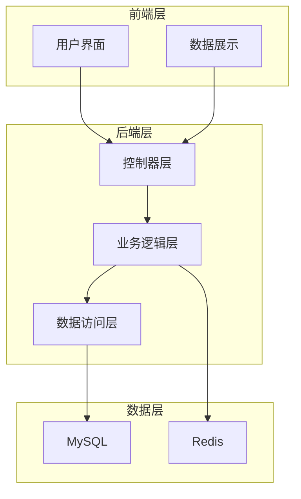
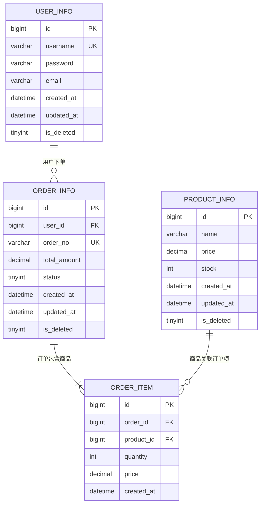

# AGENT.md - 项目架构文档

> **项目名称**：[项目名称]
> **创建日期**：[YYYY-MM-DD]
> **架构版本**：v1.0.0
> **维护负责人**：[责任人姓名]

---

## 目录

- [项目概述](#项目概述)
- [技术栈](#技术栈)
- [架构规范](#架构规范)
- [项目地图](#项目地图)
- [核心模块](#核心模块)
- [数据库设计](#数据库设计)
- [架构版本历史](#架构版本历史)
- [技术债务](#技术债务)

---

## 项目概述

### 项目简介

[简要描述项目背景、目标用户、核心价值]

### 业务范围

- [核心功能 1]
- [核心功能 2]
- [核心功能 3]

### 非功能需求

| 维度 | 要求 | 说明 |
|------|------|------|
| 性能 | QPS ≥ 1000 | 核心接口响应时间 < 200ms |
| 可用性 | 99.9% | 支持故障自动恢复 |
| 扩展性 | 水平扩展 | 支持多实例部署 |
| 安全性 | HTTPS + JWT | 数据传输加密 |

---

## 技术栈

### 后端技术栈

| 技术 | 版本 | 用途 | 说明 |
|------|------|------|------|
| Java | 17+ | 开发语言 | LTS 版本 |
| Spring Boot | 3.x | 应用框架 | 微服务开发 |
| Spring Security | 6.x | 安全框架 | JWT 认证 |
| MyBatis Plus | 3.x | ORM 框架 | 数据持久化 |
| MySQL | 8.0+ | 数据库 | 关系型数据库 |
| Redis | 7.x | 缓存/会话 | 分布式缓存 |
| Redisson | 3.x | 分布式锁 | 并发控制 |

### 前端技术栈

| 技术 | 版本 | 用途 | 说明 |
|------|------|------|------|
| Vue.js | 3.x | 前端框架 | 响应式 UI |
| Vite | 5.x | 构建工具 | 快速开发 |
| Pinia | 2.x | 状态管理 | 全局状态 |
| Vue Router | 4.x | 路由管理 | 单页应用 |
| Element Plus | 最新 | UI 组件库 | 业务组件 |

### 中间件与工具

| 技术 | 版本 | 用途 | 说明 |
|------|------|------|------|
| Maven | 3.9+ | 依赖管理 | Java 构建工具 |
| npm | v22+ | 前端包管理 | Node.js 包管理器 |
| Git | 最新 | 版本控制 | 代码版本管理 |
| Docker | 20+ | 容器化 | 应用部署 |

---

## 架构规范

### 后端规范

#### 命名规约

- **包命名**：全小写，使用反斜杠分隔（如 `com.example.controller`）
- **类命名**：大驼峰（如 `UserController`）
- **方法命名**：小驼峰（如 `getUserById`）
- **常量命名**：全大写下划线分隔（如 `MAX_RETRY_COUNT`）
- **变量命名**：小驼峰（如 `userId`）

#### 代码规范

```java
// ✅ 正确示例
public class UserService {

    private static final int MAX_RETRY_COUNT = 3; // 常量使用全大写

    public User getUserById(Long userId) {
        // Long 类型使用大写 L
        if (userId == null || userId <= 0L) {
            throw new IllegalArgumentException("用户 ID 不能为空或负数");
        }

        try {
            return userRepository.findById(userId);
        } catch (Exception e) {
            log.error("查询用户失败, userId={}", userId, e);
            throw new BusinessException("查询用户失败");
        }
    }
}

// ❌ 错误示例
public class userservice { // 类名应使用大驼峰

    private static final int maxRetryCount = 3; // 常量应使用全大写

    public User getuserbyid(Long userId) { // 方法名应使用小驼峰
        if (userId == null || userId <= 0) { // Long 类型应使用大写 L
            return null; // 不应返回 null，应抛出异常
        }
        return userRepository.findById(userId);
    }
}
```

#### 分层架构

```
controller/     # 控制器层（接收 HTTP 请求）
  └─ UserController.java

service/        # 业务逻辑层（核心业务处理）
  └─ UserService.java

repository/     # 数据访问层（数据库操作）
  └─ UserRepository.java

entity/         # 实体层（数据库表映射）
  └─ User.java

dto/            # 数据传输对象（API 请求/响应）
  ├─ UserLoginRequest.java
  └─ UserLoginResponse.java

vo/             # 视图对象（前端展示数据）
  └─ UserVO.java
```

#### 异常处理规范

```java
// 1. 自定义业务异常
public class BusinessException extends RuntimeException {
    private final String errorCode;
    private final String errorMessage;

    public BusinessException(String errorCode, String errorMessage) {
        super(errorMessage);
        this.errorCode = errorCode;
        this.errorMessage = errorMessage;
    }
}

// 2. 全局异常处理器
@RestControllerAdvice
public class GlobalExceptionHandler {

    @ExceptionHandler(BusinessException.class)
    public ResponseEntity<ErrorResponse> handleBusinessException(BusinessException e) {
        log.error("业务异常: {}", e.getErrorMessage(), e);
        return ResponseEntity.status(400)
                .body(new ErrorResponse(e.getErrorCode(), e.getErrorMessage()));
    }

    @ExceptionHandler(Exception.class)
    public ResponseEntity<ErrorResponse> handleException(Exception e) {
        log.error("系统异常", e);
        return ResponseEntity.status(500)
                .body(new ErrorResponse("SYSTEM_ERROR", "系统异常，请稍后重试"));
    }
}
```

#### 集合处理规范

```java
// ✅ 正确示例
public void processUsers(List<User> users) {
    // 判空检查
    if (CollectionUtils.isEmpty(users)) {
        return;
    }

    // 使用 Stream API
    List<String> usernames = users.stream()
            .filter(Objects::nonNull)
            .map(User::getUsername)
            .filter(StringUtils::isNotBlank)
            .toList();

    // 遍历时使用增强 for 循环
    for (User user : users) {
        // 业务处理
    }
}

// ❌ 错误示例
public void processUsers(List<User> users) {
    // 缺少判空检查
    for (int i = 0; i < users.size(); i++) { // 不应使用索引遍历 List
        User user = users.get(i);
        // 业务处理
    }
}
```

### 前端规范

#### 目录结构

```
src/
├─ api/           # API 接口封装
│   └─ user.ts
├─ components/    # 公共组件
│   └─ CustomScroll.vue
├─ pages/         # 页面组件
│   └─ UserPage.vue
├─ router/        # 路由配置
│   └─ index.ts
├─ stores/        # Pinia 状态库
│   └─ user.ts
└─ styles/        # 全局样式
    └─ index.scss
```

#### 组件命名

- **单文件组件**：大驼峰（如 `UserPage.vue`）
- **公共组件**：大驼峰 + 功能前缀（如 `BaseButton.vue`、`CustomScroll.vue`）
- **文件命名**：kebab-case（如 `user-page.vue`）

#### 代码规范

```typescript
// ✅ 正确示例
import { ref, computed } from 'vue'
import type { Ref } from 'vue'

export default defineComponent({
  name: 'UserPage',
  setup() {
    // 使用 Ref 类型注解
    const userList: Ref<User[]> = ref([])

    // 使用 computed 计算属性
    const activeUserCount = computed(() => {
      return userList.value.filter(user => user.active).length
    })

    return {
      userList,
      activeUserCount
    }
  }
})
```

### 数据库规范

#### 表命名

- 使用小写字母 + 下划线分隔（如 `user_info`）
- 所有表必须包含以下字段：
  - `id` (BIGINT, 主键)
  - `create_time` (DATETIME, 创建时间)
  - `update_time` (DATETIME, 更新时间)
  - `is_deleted` (TINYINT, 软删除标识)

#### 索引设计

```sql
-- ✅ 正确示例
CREATE TABLE `user_info` (
  `id` BIGINT NOT NULL AUTO_INCREMENT COMMENT '用户 ID',
  `username` VARCHAR(50) NOT NULL COMMENT '用户名',
  `email` VARCHAR(100) NOT NULL COMMENT '邮箱',
  `create_time` DATETIME NOT NULL DEFAULT CURRENT_TIMESTAMP COMMENT '创建时间',
  `update_time` DATETIME NOT NULL DEFAULT CURRENT_TIMESTAMP ON UPDATE CURRENT_TIMESTAMP COMMENT '更新时间',
  `is_deleted` TINYINT NOT NULL DEFAULT 0 COMMENT '是否删除：0-否，1-是',
  PRIMARY KEY (`id`),
  UNIQUE KEY `uk_username` (`username`),
  UNIQUE KEY `uk_email` (`email`),
  KEY `idx_create_time` (`create_time`)
) ENGINE=InnoDB DEFAULT CHARSET=utf8mb4 COMMENT='用户信息表';
```

---

## 项目地图

### 目录结构树

```
project-root/
├─ backend/                    # 后端项目
│  ├─ src/main/java/com/example/
│  │  ├─ controller/           # 控制器层
│  │  ├─ service/              # 业务逻辑层
│  │  ├─ repository/           # 数据访问层
│  │  ├─ entity/               # 实体层
│  │  ├─ dto/                  # 数据传输对象
│  │  ├─ vo/                   # 视图对象
│  │  ├─ config/               # 配置类
│  │  ├─ common/               # 通用工具
│  │  │  ├─ constants/         # 常量定义
│  │  │  ├─ exception/         # 异常定义
│  │  │  └─ util/              # 工具类
│  │  └─ graph/                # 业务流程编排
│  ├─ src/main/resources/
│  │  ├─ application.yml       # 应用配置
│  │  ├─ application-dev.yml   # 开发环境配置
│  │  └─ application-prod.yml  # 生产环境配置
│  ├─ init.sql                 # 数据库初始化脚本
│  ├─ pom.xml                  # Maven 依赖配置
│  └─ README.md                # 后端说明文档
│
├─ frontend/                   # 前端项目
│  ├─ src/
│  │  ├─ api/                  # API 接口封装
│  │  ├─ components/           # 公共组件
│  │  ├─ pages/                # 页面组件
│  │  ├─ router/               # 路由配置
│  │  ├─ stores/               # Pinia 状态库
│  │  ├─ styles/               # 全局样式
│  │  └─ main.ts               # 入口文件
│  ├─ package.json             # npm 依赖配置
│  ├─ vite.config.ts           # Vite 配置
│  └─ README.md                # 前端说明文档
│
├─ docs/                       # 文档目录
│  ├─ modules/                 # 模块文档
│  │  ├─ user-module.md        # 用户模块
│  │  ├─ order-module.md       # 订单模块
│  │  └─ payment-module.md     # 支付模块
│  ├─ database/                # 数据库文档
│  │  └─ schema.md             # 数据库设计
│  └─ ddd/                     # DDD 设计文档
│
├─ launch/                     # 桌面客户端
│  ├─ src/main/java/com/example/client/
│  └─ pom.xml
│
├─ docker-compose.yml          # Docker 编排配置
├─ CHANGELOG.md                # 变更日志
└─ AGENT.md                    # 项目架构文档（本文件）
```

### 核心模块依赖关系图



---

## 核心模块

### 模块索引

| 模块名称 | 文档路径 | 核心功能 | 状态 |
|----------|----------|----------|------|
| 用户模块 | [docs/modules/user-module.md](docs/modules/user-module.md) | 用户注册、登录、权限管理 | 已完成 |
| 订单模块 | [docs/modules/order-module.md](docs/modules/order-module.md) | 订单创建、支付、状态流转 | 开发中 |
| 支付模块 | [docs/modules/payment-module.md](docs/modules/payment-module.md) | 支付网关集成、退款处理 | 规划中 |
| 文件模块 | [docs/modules/file-module.md](docs/modules/file-module.md) | 文件上传、下载、预览 | 规划中 |

### 模块详情

#### 用户模块

**文档路径**：[docs/modules/user-module.md](docs/modules/user-module.md)

**核心功能**：
- 用户注册（邮箱验证、手机验证）
- 用户登录（用户名/密码、JWT 认证）
- 用户信息管理（头像、昵称、邮箱修改）
- 权限管理（角色分配、权限控制）

**数据表**：`user_info`, `user_role`, `role_permission`

**流程图**：见 [用户模块文档](docs/modules/user-module.md) 中的时序图

---

## 数据库设计

### 核心数据表

| 表名 | 说明 | 文档路径 |
|------|------|----------|
| `user_info` | 用户信息表 | [docs/database/schema.md#user_info](docs/database/schema.md#user_info) |
| `order_info` | 订单信息表 | [docs/database/schema.md#order_info](docs/database/schema.md#order_info) |
| `product_info` | 商品信息表 | [docs/database/schema.md#product_info](docs/database/schema.md#product_info) |

### ER 图



### 数据库索引设计

详见 [docs/database/schema.md](docs/database/schema.md)

---

## 架构版本历史

| 版本 | 日期 | 变更摘要 | 责任人 |
|------|------|----------|--------|
| v1.0.0 | [YYYY-MM-DD] | 初始版本，建立用户模块、订单模块基础架构 | [责任人] |

---

## 技术债务

| 优先级 | 债务描述 | 影响范围 | 计划解决时间 |
|--------|----------|----------|--------------|
| P0 | 数据库未建立索引 | 所有查询接口 | [YYYY-MM-DD] |
| P1 | 用户服务未引入缓存 | 用户信息接口 | [YYYY-MM-DD] |
| P2 | 异常日志未统一格式 | 全局日志 | [YYYY-MM-DD] |

---

## 附录

### 参考资料

- [阿里巴巴 Java 开发手册](https://github.com/alibaba/p3c)
- [Spring Boot 官方文档](https://spring.io/projects/spring-boot)
- [Vue.js 官方文档](https://vuejs.org/)
- [Mermaid 图表语法](https://mermaid.js.org/)

### 变更日志

详见 [CHANGELOG.md](CHANGELOG.md)
