# Mermaid 图表规范

本文档定义项目中使用 Mermaid 图表的标准规范，确保所有可视化图表风格统一、可读性强、易于维护。

---

## 核心原则

1. **一致性**：同类图表使用相同的样式和命名约定
2. **简洁性**：避免过度复杂的图表，突出核心逻辑
3. **可读性**：节点命名清晰、注释完整、布局合理
4. **可维护性**：模块化设计，易于扩展和修改

---

## 图表类型选择指南

| 图表类型 | 适用场景 | 示例 |
|----------|----------|------|
| **Sequence Diagram**（时序图） | 跨模块交互、API 调用流程、消息传递 | 用户登录、订单支付流程 |
| **Flowchart**（流程图） | 业务逻辑流转、数据处理流程、决策分支 | 订单状态流转、数据清洗流程 |
| **Class Diagram**（类图） | 实体关系、继承结构、接口定义 | 用户-订单-商品关系 |
| **Entity Relationship Diagram**（ER图） | 数据库表关系、外键约束、索引设计 | 核心数据表关联 |
| **State Diagram**（状态机） | 有限状态流转、生命周期管理 | 订单状态、设备在线状态 |

---

## 样式规范

### 通用配置

所有 Mermaid 图表应包含通用样式配置：

```mermaid
%%{init: {
  'theme': 'base',
  'themeVariables': {
    'primaryColor': '#e3f2fd',
    'primaryTextColor': '#1565c0',
    'primaryBorderColor': '#1565c0',
    'lineColor': '#42a5f5',
    'secondaryColor': '#f3e5f5',
    'tertiaryColor': '#fff'
  }
}}%%
```

### 命名约定

- **节点命名**：使用小写字母 + 下划线，如 `user_service`、`order_controller`
- **方法命名**：驼峰命名，如 `processOrder()`、`validateUser()`
- **参数命名**：简短清晰，如 `userId`、`orderId`

### 注释规范

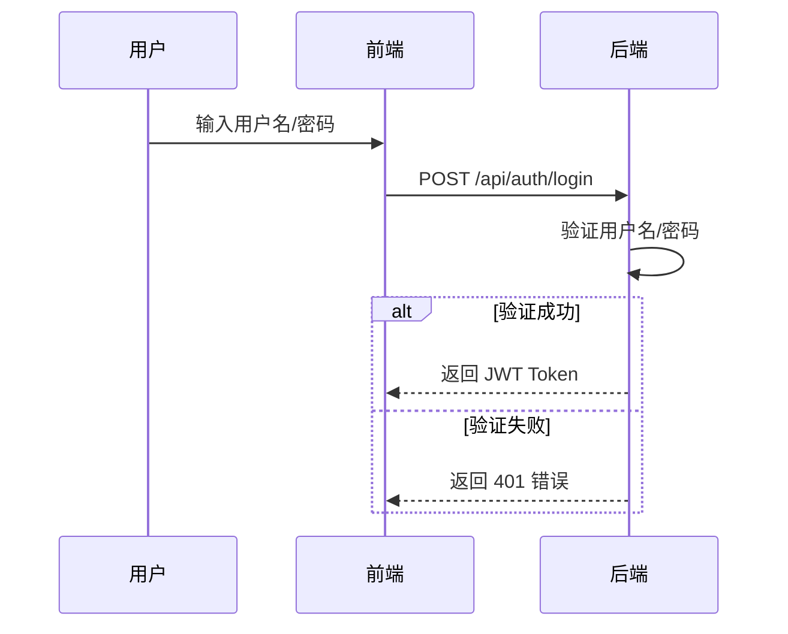

---

## Sequence Diagram 规范（时序图）

### 基本结构

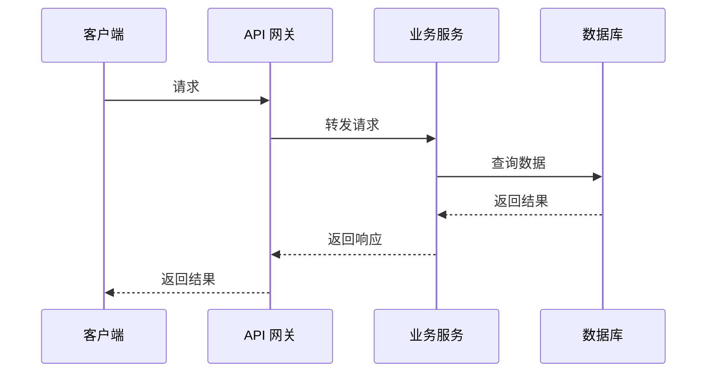

### 最佳实践

1. **参与者顺序**：从左到右按调用层次排列（客户端 → 前端 → 后端 → 数据库）
2. **消息清晰**：每个消息都应有清晰的描述（HTTP 方法 + URL 或业务动作）
3. **分组使用**：使用 `alt`、`loop`、`opt` 表示条件分支和循环
4. **异步调用**：使用 `-x` 表示异步消息

### 复杂场景示例

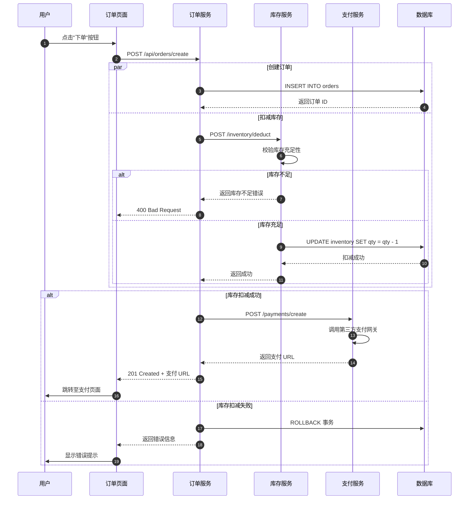

---

## Flowchart 规范（流程图）

### 基本结构

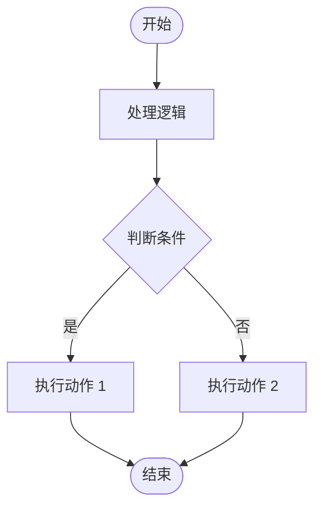

### 节点形状规范

| 形状 | 语法 | 用途 |
|------|------|------|
| 圆角矩形 | `[节点名]` | 处理步骤、操作 |
| 菱形 | `{条件名}` | 判断、决策 |
| 胶囊形 | `([开始/结束])` | 流程起点、终点 |
| 平行四边形 | `[/输入/输出/])` | 数据输入、输出 |
| 数据库 | `[(数据源)]` | 数据库操作 |

### 复杂业务流程示例

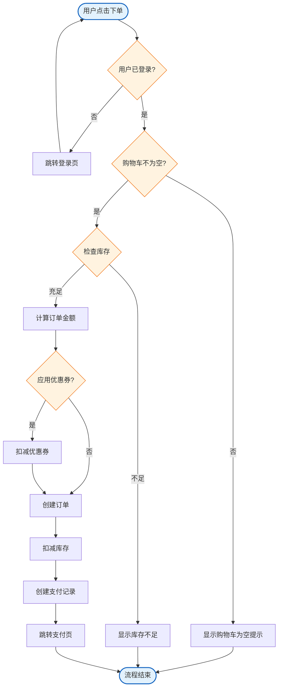

---

## Class Diagram 规范（类图）

### 基本结构

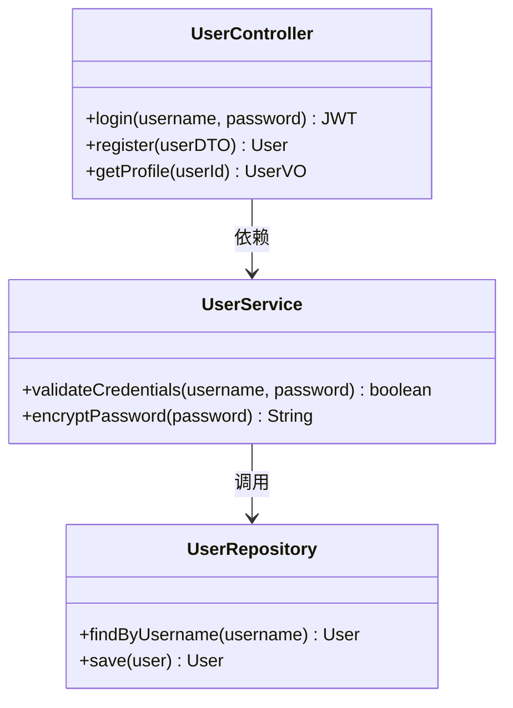

### 可见性符号

| 符号 | 含义 | 示例 |
|------|------|------|
| `+` | public | `+login()` |
| `-` | private | `-hashPassword()` |
| `#` | protected | `#validateToken()` |
| `~` | package-private | `~logRequest()` |

### 复杂实体关系示例

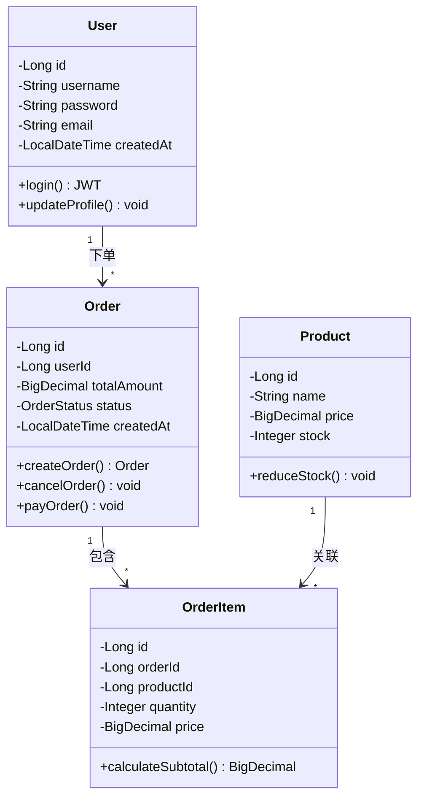

---

## Entity Relationship Diagram 规范（ER 图）

### 基本结构

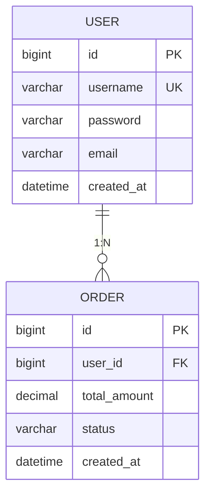

### 符号规范

| 符号 | 关系类型 | 说明 |
|------|----------|------|
| `\|\|` | 1 | 唯一或强制 |
| `o{` | 0 或 N | 可选或多个 |
| `\|o{` | 1 或 N | 强制或多个 |
| `o\|` | 0 或 1 | 可选或单个 |

### 复杂数据库关系示例

```mermaid
erDiagram
    USER {
        bigint id PK
        varchar username UK
        varchar password
        varchar email
        tinyint status
        datetime created_at
        datetime updated_at
        tinyint is_deleted
    }

    ORDER {
        bigint id PK
        bigint user_id FK
        varchar order_no UK
        decimal total_amount
        tinyint status
        datetime created_at
        datetime updated_at
        tinyint is_deleted
    }

    ORDER_ITEM {
        bigint id PK
        bigint order_id FK
        bigint product_id FK
        int quantity
        decimal price
        datetime created_at
    }

    PRODUCT {
        bigint id PK
        varchar name
        varchar description
        decimal price
        int stock
        datetime created_at
        datetime updated_at
        tinyint is_deleted
    }

    PAYMENT {
        bigint id PK
        bigint order_id FK
        varchar payment_no UK
        decimal amount
        tinyint status
        datetime created_at
        datetime updated_at
    }

    USER ||--o{ ORDER : "用户下单"
    ORDER ||--|{ ORDER_ITEM : "订单包含商品"
    PRODUCT ||--o{ ORDER_ITEM : "商品关联订单项"
    ORDER ||--\| PAYMENT : "订单对应支付"
```

---

## State Diagram 规范（状态机）

### 基本结构

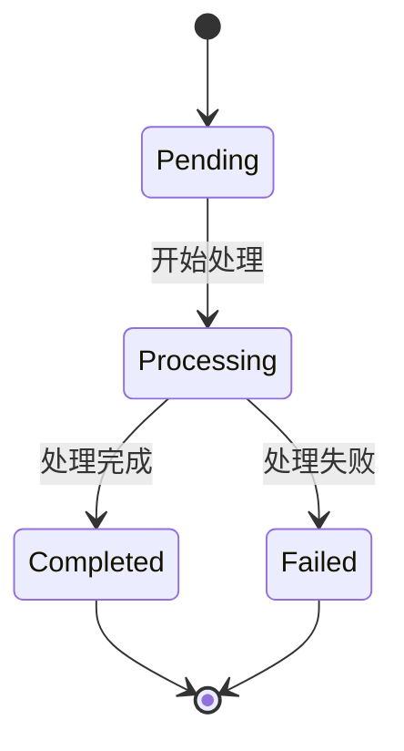

### 复杂状态流转示例

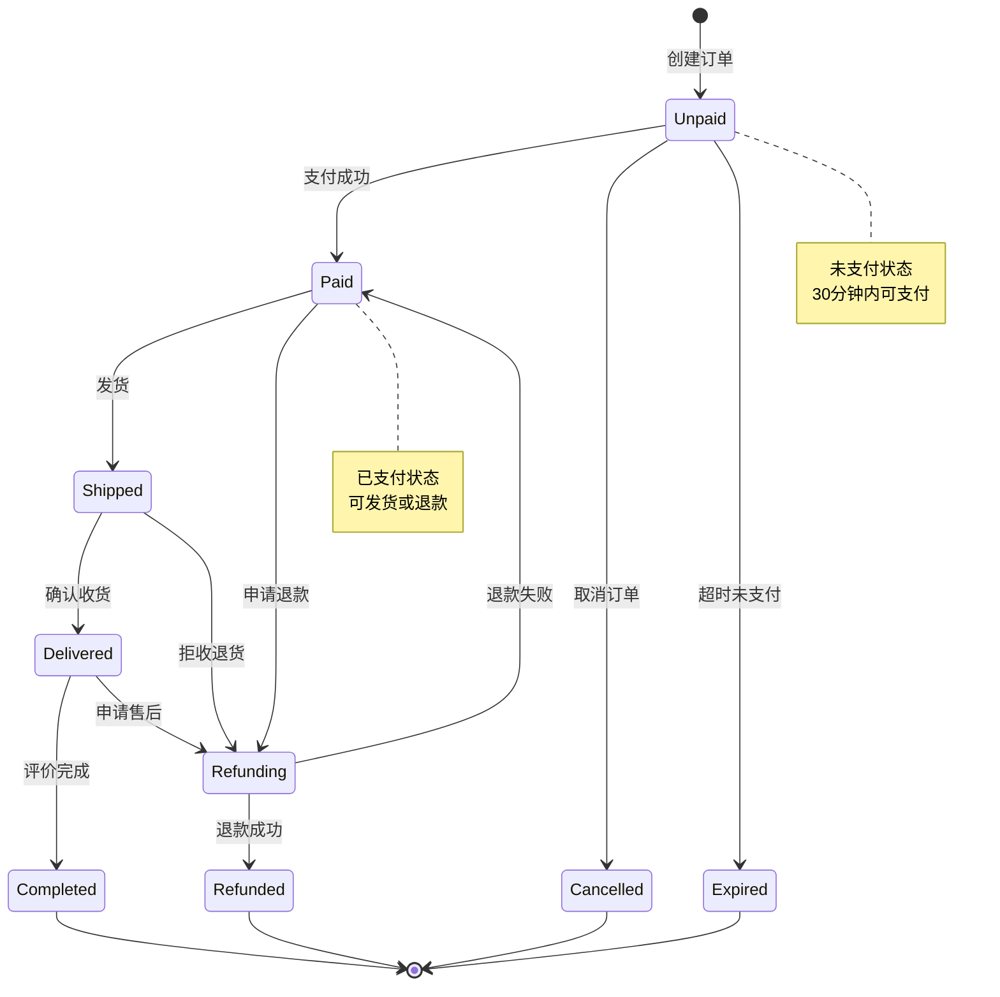

---

## 图表布局优化

### 自动布局方向

```mermaid
flowchart TD  %% TD: Top-Down (从上到下)
%% flowchart LR  %% LR: Left-Right (从左到右)
%% flowchart BT  %% BT: Bottom-Top (从下到上)
```

### 子图（Subgraph）使用

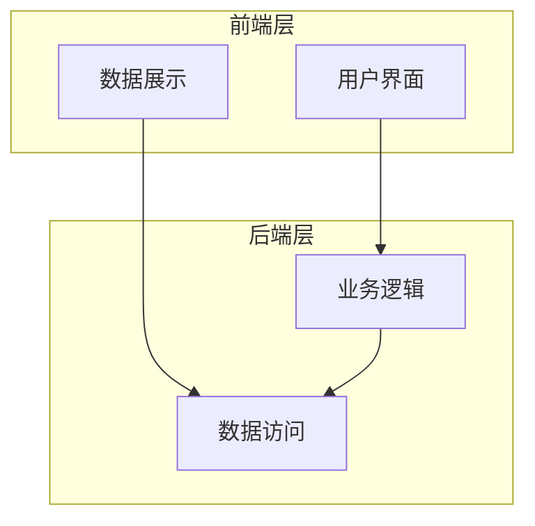

### 样式自定义

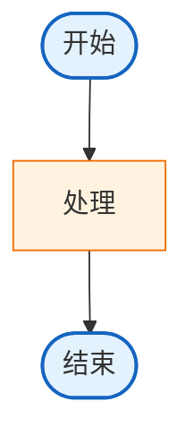

---

## 图表维护清单

每次更新图表时，请检查：

- [ ] 图表是否与实际代码/数据库一致
- [ ] 是否包含必要的注释说明
- [ ] 节点命名是否清晰、符合规范
- [ ] 流程逻辑是否完整，无遗漏分支
- [ ] 样式是否统一（颜色、字体、线宽）
- [ ] 复杂图表是否使用了分组（subgraph）
- [ ] 是否标注了关键的业务规则或约束
- [ ] 是否在 Markdown 编辑器中可以正确渲染

---

## 常见问题

### Q1: 图表太大无法查看怎么办？

**A**: 拆分为多个子图表，或使用 `click` 事件实现跳转（部分 Markdown 编辑器支持）。

### Q2: 如何处理循环引用？

**A**: 使用 `loop` 关键字（Sequence Diagram）或明确的箭头指向（Flowchart）。

### Q3: 图表渲染失败怎么办？

**A**: 检查语法是否正确，尤其是特殊字符（如 `|`, `{`, `}`）是否需要转义。
