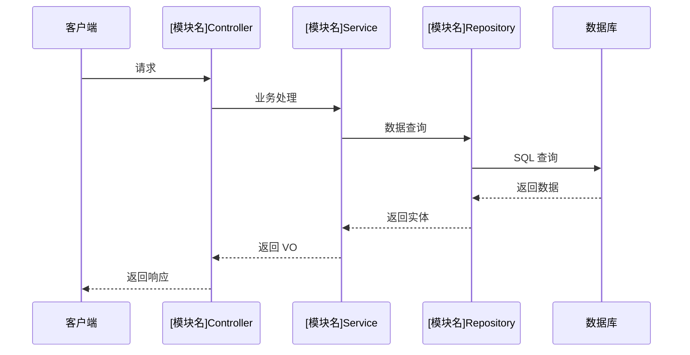
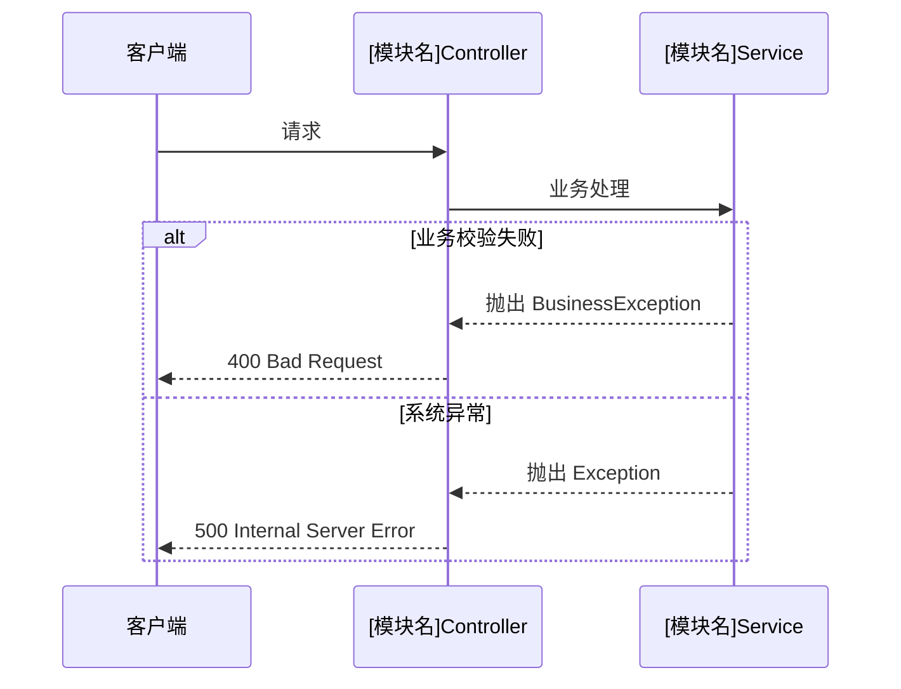
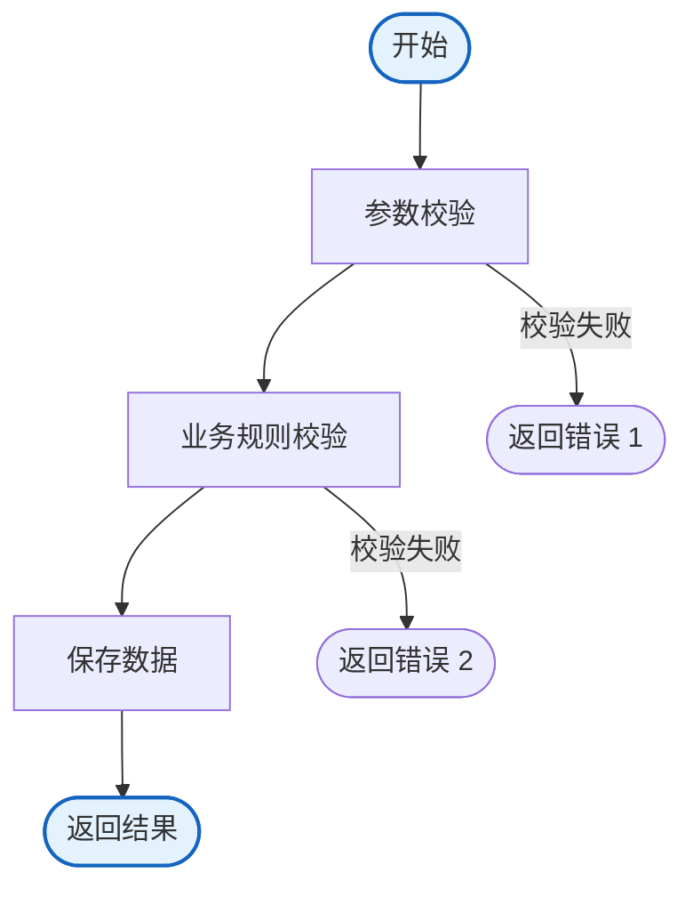
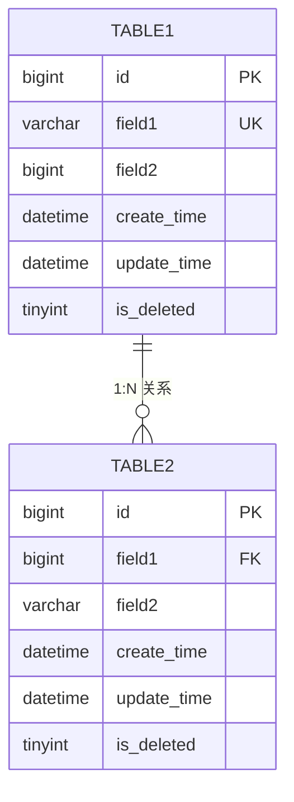

# [模块名称] 模块文档

> **模块名称**：[模块名称]
> **创建日期**：[YYYY-MM-DD]
> **负责人**：[责任人姓名]
> **状态**：[已完成/开发中/规划中]

---

## 目录

- [模块概述](#模块概述)
- [核心功能](#核心功能)
- [业务流程](#业务流程)
- [数据模型](#数据模型)
- [接口设计](#接口设计)
- [类图设计](#类图设计)
- [技术实现](#技术实现)
- [测试用例](#测试用例)
- [变更记录](#变更记录)

---

## 模块概述

### 模块简介

[简要描述模块的功能定位、业务场景、核心价值]

### 业务边界

- **输入**：[模块接收的外部输入]
- **输出**：[模块产生的输出]
- **依赖**：[依赖的其他模块或服务]
- **被依赖**：[依赖本模块的其他服务]

### 业务规则

1. [业务规则 1]
2. [业务规则 2]
3. [业务规则 3]

---

## 核心功能

| 功能名称 | 功能描述 | 优先级 | 状态 |
|----------|----------|--------|------|
| [功能 1] | [功能描述] | P0 | 已完成 |
| [功能 2] | [功能描述] | P1 | 开发中 |
| [功能 3] | [功能描述] | P2 | 规划中 |

---

## 业务流程

### 核心流程图



### 异常流程



### 数据流转图



---

## 数据模型

### 数据表设计

#### [表名 1]

```sql
CREATE TABLE `[table_name_1]` (
  `id` BIGINT NOT NULL AUTO_INCREMENT COMMENT '主键 ID',
  `field1` VARCHAR(50) NOT NULL COMMENT '字段 1',
  `field2` BIGINT NOT NULL COMMENT '字段 2',
  `create_time` DATETIME NOT NULL DEFAULT CURRENT_TIMESTAMP COMMENT '创建时间',
  `update_time` DATETIME NOT NULL DEFAULT CURRENT_TIMESTAMP ON UPDATE CURRENT_TIMESTAMP COMMENT '更新时间',
  `is_deleted` TINYINT NOT NULL DEFAULT 0 COMMENT '是否删除：0-否，1-是',
  PRIMARY KEY (`id`),
  UNIQUE KEY `uk_field1` (`field1`),
  KEY `idx_field2` (`field2`),
  KEY `idx_create_time` (`create_time`)
) ENGINE=InnoDB DEFAULT CHARSET=utf8mb4 COMMENT='[表 1 注释]';
```

**字段说明**：

| 字段名 | 类型 | 是否必填 | 索引 | 说明 |
|--------|------|----------|------|------|
| `id` | BIGINT | 是 | PK | 主键 ID |
| `field1` | VARCHAR(50) | 是 | UK | 唯一标识 |
| `field2` | BIGINT | 是 | INDEX | 外键关联 |
| `create_time` | DATETIME | 是 | INDEX | 创建时间 |
| `update_time` | DATETIME | 是 | - | 更新时间 |
| `is_deleted` | TINYINT | 是 | - | 软删除标识 |

#### [表名 2]

```sql
CREATE TABLE `[table_name_2]` (
  `id` BIGINT NOT NULL AUTO_INCREMENT COMMENT '主键 ID',
  `field1` BIGINT NOT NULL COMMENT '字段 1',
  `field2` VARCHAR(100) NOT NULL COMMENT '字段 2',
  `create_time` DATETIME NOT NULL DEFAULT CURRENT_TIMESTAMP COMMENT '创建时间',
  `update_time` DATETIME NOT NULL DEFAULT CURRENT_TIMESTAMP ON UPDATE CURRENT_TIMESTAMP COMMENT '更新时间',
  `is_deleted` TINYINT NOT NULL DEFAULT 0 COMMENT '是否删除：0-否，1-是',
  PRIMARY KEY (`id`),
  KEY `idx_field1` (`field1`),
  KEY `idx_create_time` (`create_time`)
) ENGINE=InnoDB DEFAULT CHARSET=utf8mb4 COMMENT='[表 2 注释]';
```

### ER 图



### 测试数据

```sql
-- 插入测试数据
INSERT INTO `[table_name_1]` (`field1`, `field2`) VALUES
('value1', 1L),
('value2', 2L),
('value3', 3L);

INSERT INTO `[table_name_2]` (`field1`, `field2`) VALUES
(1L, 'description1'),
(1L, 'description2'),
(2L, 'description3');
```

---

## 接口设计

### Controller 层

#### [接口 1]

```java
@RestController
@RequestMapping("/api/[module]")
@RequiredArgsConstructor
public class [Module]Controller {

    private final [Module]Service service;

    /**
     * [接口功能描述]
     *
     * @param request 请求参数
     * @return 响应结果
     */
    @PostMapping("/action1")
    public ResponseEntity<CommonResponse<[Vo]>> action1(
            @Valid @RequestBody [Request] request) {

        [Vo] result = service.action1(request);
        return ResponseEntity.ok(CommonResponse.success(result));
    }
}
```

**接口说明**：

| 项目 | 内容 |
|------|------|
| 接口名称 | [接口名称] |
| 请求方法 | POST |
| 请求路径 | `/api/[module]/action1` |
| 功能描述 | [功能描述] |
| 请求参数 | [Request] |
| 响应结果 | [Vo] |
| 权限要求 | [权限要求] |

#### [接口 2]

```java
/**
 * [接口功能描述]
 *
 * @param id 查询参数
 * @return 响应结果
 */
@GetMapping("/{id}")
public ResponseEntity<CommonResponse<[Vo]>> getById(
        @PathVariable Long id) {

    [Vo] result = service.getById(id);
    return ResponseEntity.ok(CommonResponse.success(result));
}
```

**接口说明**：

| 项目 | 内容 |
|------|------|
| 接口名称 | [接口名称] |
| 请求方法 | GET |
| 请求路径 | `/api/[module]/{id}` |
| 功能描述 | [功能描述] |
| 请求参数 | id (Long) |
| 响应结果 | [Vo] |
| 权限要求 | [权限要求] |

---

## 类图设计

### 核心类图

```mermaid
classDiagram
    class [Module]Controller {
        +action1(request) [Vo]
        +getById(id) [Vo]
    }

    class [Module]Service {
        -[Module]Repository repository
        +action1(request) [Vo]
        +getById(id) [Vo]
        +validate(request) boolean
    }

    class [Module]Repository {
        +findById(id) [Entity]
        +save(entity) [Entity]
        +findByField1(field1) List~[Entity]~
    }

    class [Entity] {
        -Long id
        -String field1
        -Long field2
        -LocalDateTime createTime
        +getId() Long
    }

    class [Request] {
        -String field1
        -Long field2
        +getField1() String
        +getField2() Long
    }

    class [Vo] {
        -Long id
        -String field1
        -String field2Display
        +getId() Long
    }

    [Module]Controller --> [Module]Service : 依赖
    [Module]Service --> [Module]Repository : 调用
    [Module]Repository --> [Entity] : 操作
    [Request] ..> [Entity] : 转换为
    [Entity] ..> [Vo] : 转换为
```

### 依赖关系

```
[Module]Controller
    ↓ 依赖
[Module]Service
    ↓ 调用
[Module]Repository
    ↓ 操作
[Entity] (数据库表映射)
```

---

## 技术实现

### Service 层核心逻辑

```java
@Service
@RequiredArgsConstructor
public class [Module]Service {

    private final [Module]Repository repository;

    /**
     * [功能描述]
     *
     * @param request 请求参数
     * @return 响应结果
     */
    @Transactional(rollbackFor = Exception.class)
    public [Vo] action1([Request] request) {
        // 1. 参数校验
        if (StringUtils.isBlank(request.getField1())) {
            throw new BusinessException("FIELD1_REQUIRED", "field1 不能为空");
        }

        // 2. 业务规则校验
        if (!validate(request)) {
            throw new BusinessException("BUSINESS_RULE_ERROR", "业务规则校验失败");
        }

        // 3. 查询数据
        [Entity] entity = repository.findByField1(request.getField1())
                .orElseThrow(() -> new BusinessException("NOT_FOUND", "数据不存在"));

        // 4. 业务处理
        entity.setField2(request.getField2());
        repository.save(entity);

        // 5. 转换为 VO
        return convertToVo(entity);
    }

    /**
     * 业务规则校验
     *
     * @param request 请求参数
     * @return 校验结果
     */
    private boolean validate([Request] request) {
        // 实现业务规则校验逻辑
        return true;
    }

    /**
     * 实体转换为 VO
     *
     * @param entity 实体对象
     * @return VO 对象
     */
    private [Vo] convertToVo([Entity] entity) {
        return [Vo].builder()
                .id(entity.getId())
                .field1(entity.getField1())
                .field2Display(String.valueOf(entity.getField2()))
                .build();
    }
}
```

### DTO/VO 转换

```java
// Request → Entity
[Entity] entity = [Entity].builder()
        .field1(request.getField1())
        .field2(request.getField2())
        .build();

// Entity → VO
[Vo] vo = [Vo].builder()
        .id(entity.getId())
        .field1(entity.getField1())
        .field2Display(formatField2(entity.getField2()))
        .build();
```

### 异常处理

```java
try {
    // 业务逻辑
} catch ([SpecificException] e) {
    log.error("业务异常, field1={}", request.getField1(), e);
    throw new BusinessException("BUSINESS_ERROR", e.getMessage());
} catch (Exception e) {
    log.error("系统异常, field1={}", request.getField1(), e);
    throw new BusinessException("SYSTEM_ERROR", "系统异常，请稍后重试");
}
```

---

## 测试用例

### 单元测试

```java
@SpringBootTest
class [Module]ServiceTest {

    @Autowired
    private [Module]Service service;

    @MockBean
    private [Module]Repository repository;

    @Test
    void testAction1_Success() {
        // Given
        [Request] request = [Request].builder()
                .field1("test_value")
                .field2(1L)
                .build();

        [Entity] entity = [Entity].builder()
                .id(1L)
                .field1("test_value")
                .field2(1L)
                .build();

        when(repository.findByField1("test_value"))
                .thenReturn(Optional.of(entity));

        // When
        [Vo] result = service.action1(request);

        // Then
        assertThat(result).isNotNull();
        assertThat(result.getId()).isEqualTo(1L);
    }

    @Test
    void testAction1_Field1Required() {
        // Given
        [Request] request = [Request].builder()
                .field1("")
                .field2(1L)
                .build();

        // When & Then
        assertThatThrownBy(() -> service.action1(request))
                .isInstanceOf(BusinessException.class)
                .hasMessageContaining("field1 不能为空");
    }
}
```

### 接口测试

```bash
# 测试接口 1
curl -X POST http://localhost:8080/api/[module]/action1 \
  -H "Content-Type: application/json" \
  -H "Authorization: Bearer <token>" \
  -d '{
    "field1": "test_value",
    "field2": 1
  }'

# 测试接口 2
curl -X GET http://localhost:8080/api/[module]/1 \
  -H "Authorization: Bearer <token>"
```

### 测试用例清单

| 用例编号 | 测试场景 | 预期结果 | 状态 |
|----------|----------|----------|------|
| TC001 | 正常场景 | 返回成功 | 已通过 |
| TC002 | field1 为空 | 返回错误 400 | 已通过 |
| TC003 | 业务规则校验失败 | 返回错误 400 | 待测试 |
| TC004 | 数据不存在 | 返回错误 404 | 待测试 |

---

## 变更记录

| 版本 | 日期 | 变更内容 | 责任人 |
|------|------|----------|--------|
| v1.0.0 | [YYYY-MM-DD] | 初始版本，建立核心功能 | [责任人] |

---

## 附录

### 参考资料

- [阿里巴巴 Java 开发手册](https://github.com/alibaba/p3c)
- [Spring Boot 官方文档](https://spring.io/projects/spring-boot)

### 相关文档

- [AGENT.md](../AGENT.md) - 项目架构主文档
- [docs/database/schema.md](../database/schema.md) - 数据库设计文档
