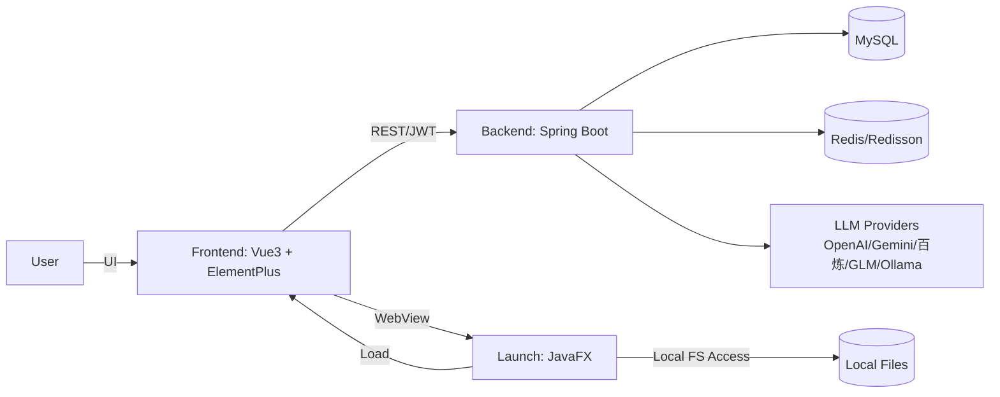
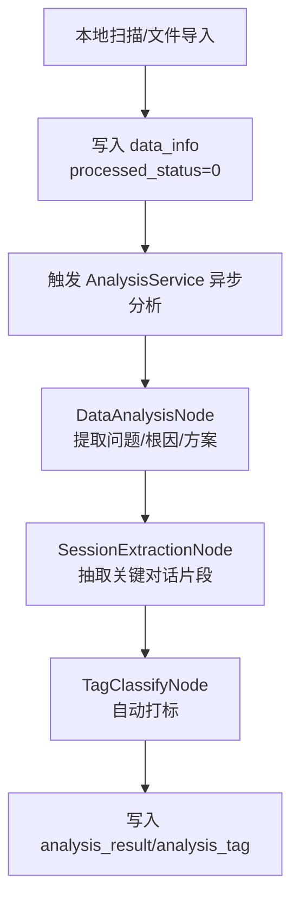
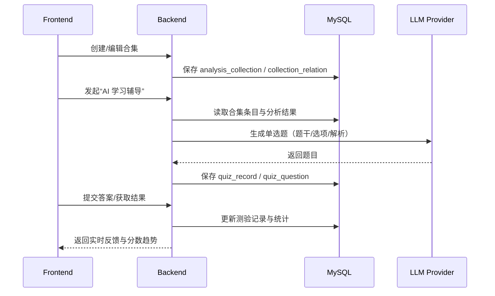

# Review Agent 架构基座（AGENT 文档）

本文件用于为 AI 代理提供项目“长效记忆”：项目边界、分层约束、核心流程、关键数据模型与工程规范。日常开发完成一个功能点后，应同步更新本文件对应章节，确保文档与代码一致。

## 架构版本历史

| 版本 | 日期 | 变更摘要 |
|---|---|---|
| v1.0 | 2026-01-24 ~ 2026-01-31 | AppleStyle 视觉体系演进；学习成就模块落地；后端认证/SSE/线程池/软删除/性能优化 |
| v1.1 | 2026-02-03 | 习题模块页面间距规范化（参考 DataPage 顶栏设计） |

## 1. 项目定位与边界

**Review Agent** 是一个辅助开发者复盘技术问题、构建个人技术认知知识库的工具，核心目标是把“即时问答”沉淀为“可检索、可复习”的结构化知识。

### 1.1 核心价值

- 自动扫描并解析本地 AI 聊天记录（文件级数据源）
- 通过 LLM 抽取问题本质、根因、解决方案与关键片段（结构化沉淀）
- 通过标签与合集构建知识体系（组织与复用）
- 基于历史内容生成测验题辅助复习（主动学习闭环）

### 1.2 非目标（当前不做）

- 通用笔记系统或通用知识管理平台
- 复杂的多租户/组织权限体系（以个人使用为主）
- 将 LLM 输出当作“强一致事实源”（结果需可解释与可追溯）

## 2. 技术栈与运行环境

### 2.1 技术栈

- 后端：Java 17+，Spring Boot 3.x，JPA，Lombok
- 数据：MySQL 8.0+，Redis（Redisson）
- AI：MultiLLMConfig（多提供商接入），Spring AI（VectorStore）
- 前端：Vue 3，Vite，Pinia，Vue Router，Element Plus
- 可视化：ECharts，echarts-wordcloud
- Markdown：markdown-it，highlight.js
- 桌面端：JavaFX（WebView 容器 + 本地文件系统访问能力）

## 3. 总体架构

### 3.1 组件关系图



### 3.2 关键约束

- 鉴权：前端仅发送 `Authorization: Bearer <JWT>`，不再发送 `userId` Header；后端统一从 Security Context 获取当前用户 ID（`SecurityUtils.getCurrentUserId()`）。
- 可视化与交互：前端统一遵循 AppleStyle（Modern Glass、无边框输入、圆角、平滑过渡），滚动区域必须使用 CustomScroll/ScrollStack 组件。
- 数据一致性：涉及写操作的 Service 关键方法需显式事务边界（`@Transactional(rollbackFor = Exception.class)`），并遵循软删除约定（见 6.2）。

## 4. 代码结构与分层约束

### 4.1 后端目录职责（backend/）

- `common/`：通用工具、常量、统一异常与响应封装
- `config/`：Spring 配置（LLM、Redis、WebMvc、线程池等）
- `controller/`：REST 接口层，仅做参数校验/组装/调用 Service
- `entity/`：实体/DTO/VO/Request；Entity 与 DTO/VO 边界清晰，避免跨层复用导致污染
- `graph/`：业务流程编排（节点/钩子），用于分析任务链路
- `repository/`：JPA 数据访问层，聚合常用查询与批量操作
- `service/`：核心业务逻辑，承载事务与领域规则
- `schedule/`：定时任务（如 SSE 心跳）

### 4.2 前端目录职责（frontend/src/）

- `api/`：Axios 封装与接口定义
- `components/`：可复用组件（含 CustomScroll、ScrollStack）
- `pages/`：路由页面与页面内组件
- `router/`：路由配置
- `stores/`：Pinia（auth/chat/theme 等）
- `styles/`：全局样式（SCSS）

### 4.3 启动器（launch/）

- JavaFX 应用入口：负责加载 WebView、提供本地文件系统访问与能力桥接（用于扫描导入）

### 4.4 前端组件化与架构规范

**组件化原则**：

| 原则 | 说明 |
|------|------|
| 单一职责 | 每个组件只负责一个功能域，便于测试和维护 |
| 路由优于滚动 | 使用路由切换替代页面内滚动，符合 SPA 最佳实践 |
| Props/Emits 明确 | 组件输入输出清晰，避免直接操作父组件状态 |
| 样式复用 | 公共样式通过全局样式或样式文件复用 |

**目录组织规范**：

```
pages/
├── config/                    # 功能模块目录
│   ├── index.vue              # 布局容器（侧边栏 + router-view）
│   ├── BasicInfoPage.vue      # 独立页面组件
│   ├── ScanConfigPage.vue
│   └── components/           # 模块内共享组件
│       ├── ConfigSidebar.vue   # 可复用组件
│       └── PasswordDialog.vue
├── profile/                   # 另一个功能模块目录
│   ├── index.vue
│   ├── components/
│   └── composables/
└── ...
```

**Vue Router 路由嵌套规范**：

```javascript
{
  path: '/config',
  component: ConfigPage,        // 布局容器
  redirect: '/config/basic',   // 默认子路由
  children: [
    { path: 'basic', component: BasicInfoPage },
    { path: 'scan', component: ScanConfigPage },
    { path: 'push', component: PushConfigPage },
    { path: 'model-provider', component: ModelProviderConfig },
    { path: 'default-model', component: DefaultModelConfig },
    { path: 'about', component: AboutUsPage }
  ]
}
```

**常见陷阱与解决方案**：

| 问题 | 原因 | 解决方案 |
|------|------|----------|
| `onBeforeRouteLeave` 导入错误 | 从 `vue` 导入而非 `vue-router` | `import { onBeforeRouteLeave } from 'vue-router'` |
| v-model 绑定 props 报错 | `v-model="modelValue"` 直接绑定 props 是只读的 | 使用 computed getter/setter |
| 嵌套 ref 属性 v-model 不稳定 | `passwordForm.oldPassword` 嵌套属性 | 为每个字段创建独立 computed |
| API 路径错误 | 移动文件后相对路径变化 | 移动后更新 import 路径 |

**Computed Getter/Setter 模式**：

```vue
<script setup>
const props = defineProps({
  modelValue: {
    type: Boolean,
    default: false
  }
})

const emit = defineEmits(['update:modelValue'])

// Dialog visibility
const dialogVisible = computed({
  get: () => props.modelValue,
  set: (val) => emit('update:modelValue', val)
})

// Form field bindings
const passwordForm = ref({
  oldPassword: '',
  newPassword: '',
  confirm: ''
})

const oldPassword = computed({
  get: () => passwordForm.value.oldPassword,
  set: (val) => passwordForm.value.oldPassword = val
})
</script>

<template>
  <el-dialog v-model="dialogVisible">
    <el-input v-model="oldPassword" />
  </el-dialog>
</template>
```

**路由守卫与状态管理**：

```vue
<script setup>
import { onBeforeRouteLeave } from 'vue-router'
import { ElMessageBox } from 'element-plus'

const originalForm = ref(null)
const form = ref({ /* ... */ })

onMounted(async () => {
  await loadData()
  // 保存原始配置用于变更检测
  originalForm.value = JSON.parse(JSON.stringify(form.value))
})

onBeforeRouteLeave((to, from, next) => {
  if (!originalForm.value) {
    next()
    return
  }

  const normalize = (f) => JSON.stringify(JSON.parse(JSON.stringify(f)))
  if (normalize(form.value) !== normalize(originalForm.value)) {
    ElMessageBox.confirm(
      '您有未保存的更改，确定要离开吗？',
      '未保存更改',
      {
        confirmButtonText: '保存并离开',
        cancelButtonText: '放弃修改',
        distinguishCancelAndClose: true,
        type: 'warning',
      }
    )
      .then(async () => {
        await saveConfig()
        next()
      })
      .catch((action) => {
        if (action === 'cancel') next()
        else next(false)
      })
  } else {
    next()
  }
})
</script>
```

**组件设计最佳实践**：

1. **Props 设计**：明确组件接受的输入参数，使用 TypeScript 或 JSDoc 注释类型
2. **Emits 设计**：明确组件触发的事件，使用 `defineEmits` 声明
3. **默认值处理**：为可选 props 提供合理的默认值
4. **事件命名**：遵循 Vue 3 规范，使用 kebab-case（如 `update:modelValue`）
5. **样式隔离**：使用 `scoped` 或 CSS Modules 避免样式污染

## 5. 核心模块索引（业务视角）

| 模块 | 职责边界 | 核心组件（示例） | 关键数据表 |
|---|---|---|---|
| 文件同步与管理（Sync & Data） | 扫描/导入文件，维护元数据与状态流转 | SyncRecordController，DataInfoService | `data_info`，`sync_record`，`user_config` |
| 智能分析（Analysis） | 异步分析文件，抽取结构化结果与标签 | AnalysisService，DataAnalysisNode，SessionExtractionNode，TagClassifyNode | `analysis_result`，`analysis_tag` |
| 标签与合集（Tags & Collections） | 两级标签体系；合集聚合与条目管理 | TagPage（前端），CollectionService（后端） | `main_tag`，`sub_tag`，`tag_relation`，`analysis_collection`，`collection_relation` |
| AI 学习辅导（Quiz） | 基于合集生成题目、答题与记录 | QuizPage（独立页面），QuestionRenderer（答题组件），QuizService（后端） | `quiz_record`，`quiz_question` |
| 错题本（Mistake Book） | 错题记录、复习推荐、掌握状态追踪 | MistakeBookPage（前端），MistakeBookService（后端） | `quiz_mistake` |
| 报表与统计（Report & Statistics） | 日/周报与可视化统计 | StatisticController，WordCloudPage | `report_data` |
| 系统配置（Config） | 扫描、推送、LLM 提供商配置与默认模型 | ConfigPage，ModelConfig | `user_config`（含扫描路径/开关） |
| 学习成就（Learning Achievements） | 成就定义、用户成就进度与趋势图表 | AchievementDefinition/UserAchievement，UserService.getUserStats | `achievement_definition`，`user_achievement` |

## 6. 核心业务流程（可视化）

### 6.1 文件同步与分析流水线



### 6.2 合集与测验闭环



### 6.3 学习成就计算链路（UserStats）

```mermaid
flowchart LR
  S[getUserStats] --> T[读取 quiz_record/quiz_question]
  T --> A[计算分数趋势]
  T --> B[计算知识点掌握度]
  S --> C[读取 user_achievement/achievement_definition]
  A --> D[checkAndUnlockAchievements]
  B --> D
  D --> E[calculateLearningProgress]
  E --> R[返回 UserStatsVo(成就/趋势/掌握度/进度)]
```

## 7. 数据模型与数据库约定

### 7.1 实体关系（ER 概览）

- User (1) -- (N) DataInfo（文件）
- DataInfo (1) -- (1) AnalysisResult（分析结果）
- AnalysisResult (1) -- (N) AnalysisTag（自动标签）
- AnalysisResult (N) -- (N) AnalysisCollection（合集）
- MainTag (1) -- (N) SubTag（通过 `tag_relation`）
- AnalysisCollection (1) -- (N) QuizRecord（测验记录）
- QuizRecord (1) -- (N) QuizQuestion（题目）
- User (1) -- (N) QuizMistake（错题记录）
- QuizQuestion (1) -- (N) QuizMistake（题目错题）
- User (1) -- (N) UserAchievement（用户成就）
- AchievementDefinition (1) -- (N) UserAchievement（用户成就记录）

### 7.2 软删除约定（核心实体）

软删除覆盖以下核心数据：DataInfo、AnalysisResult、AnalysisCollection、QuizRecord。

- 字段：`deleted`（Boolean），`deleted_at`（时间字段）
- Repository：提供 `softDelete()` / `hardDelete()`；查询默认过滤已删除数据
- Service：提供 `restore()` 支持恢复

## 8. 安全与接口约定

### 8.1 认证与用户上下文

- 前端：只发送 Authorization Header（JWT）
- 后端：Controller 不接收 `@RequestHeader("userId")`；统一注入SecurityUtils Bean使用 `securityUtils.getCurrentUserId()` 方法获取用户

### 8.2 SSE 连接管理

- 使用连接管理器控制并发连接数（上限 1000）
- 连接完成/超时/异常时自动移除，避免内存泄漏
- 心跳任务每 30 秒发送心跳检测

## 9. 前端 AppleStyle 设计规范（精简版）

### 9.1 设计原则

- 简约至上：减少硬边框，突出内容
- 视觉层次：阴影/模糊/透明度构建空间感
- 微交互：平滑过渡与即时反馈
- 深色模式：全链路适配

### 9.2 滚动条规范（强制）

所有需要滚动条的场景必须使用：

- `frontend/src/components/CustomScroll.vue`
- `frontend/src/components/ScrollStack/`

### 9.3 通用样式基准（参考）

动画曲线（Apple Spring）：
`cubic-bezier(0.25, 1, 0.5, 1)` 或更自然的 `cubic-bezier(0.175, 0.885, 0.32, 1.275)`

卡片：

```css
.apple-card {
  background: var(--el-bg-color);
  border-radius: 16px;
  box-shadow: 0 2px 12px rgba(0, 0, 0, 0.08);
  border: 1px solid var(--el-border-color-light);
  backdrop-filter: blur(10px);
  transition: all 0.3s cubic-bezier(0.25, 1, 0.5, 1);
}
```

输入框：

```css
.apple-input {
  background: var(--el-fill-color-light);
  border: none;
  border-radius: 12px;
  padding: 12px 16px;
  transition: all 0.3s ease;
}
```

按钮：

```css
.apple-button {
  border-radius: 20px;
  padding: 10px 24px;
  font-weight: 500;
  transition: all 0.3s cubic-bezier(0.4, 0, 0.2, 1);
}
```

### 9.4 页面布局间距规范（参考 DataPage.vue）

**核心原则**：使用容器级 `gap` 控制间距，而非在子组件中设置 padding，以获得更灵活和统一的布局控制。

**典型页面布局结构**：

```css
/* 1. 页面根容器 - 使用 gap 控制工具栏与内容的间距 */
.page-root {
  display: flex;
  flex-direction: column;
  height: 100vh;
  width: 100vw;
  gap: 16px;           /* 统一的组件间距 */
  padding: 0 4px;      /* 轻微的左右边距 */
  min-height: 0;        /* 关键：确保 flex 子项正确收缩 */
}

/* 2. 顶部工具栏 - 最小垂直 padding */
.toolbar {
  flex-shrink: 0;
  display: flex;
  align-items: center;
  padding: 4px 0;      /* 最小垂直 padding，非 16px+ */
  gap: 16px;
}

/* 3. 内容区域 - 零 padding，依赖容器 gap */
.content-area {
  flex: 1;
  padding: 0;          /* 无 padding，间距由父容器 gap 控制 */
  overflow: hidden;
  min-height: 0;        /* 关键：确保 flex 子项正确收缩 */
}
```

**关键设计决策**：

| 场景 | 推荐值 | 原因 |
|------|--------|------|
| 工具栏垂直 padding | `4px 0` | 最小化留白，保持紧凑 |
| 页面容器 gap | `16px` | 统一的组件间间距 |
| 内容区域 padding | `0` | 依赖容器 gap 控制，避免累积 |
| flex 子项 min-height | `0` | 确保 flex 子项能正确收缩，避免溢出 |

**示例参考**：
- ✅ **正例**：`DataPage.vue` (toolbar: `padding: 4px 0`, content-area: `padding: 0`)
- ✅ **正例**：`quiz/index.vue` (已优化，遵循此规范)
- ❌ **反例**：工具栏使用 `padding: 16px 24px`（过大）+ 内容区域使用 `padding: 16px 24px 24px 24px`（冗余）

## 10. 近期变更摘要（沉淀归档）

### 10.1 错题本模块（Mistake Book）- 完整实现
错题本模块**详细文档：** [docs/modules/mistake-book.md](docs/modules/mistake-book.md)

### 10.4 AppleStyle 视觉演进（设置页与全局体验）

- 设置页：分组布局、侧边栏高亮、输入无边框、底部悬浮保存条、离开未保存确认
- 统一：Glassmorphism、圆角、阴影、深浅色自适应

### 10.7 侧边栏与全局样式微调

- **侧边栏优化**：将侧边栏左间距从 20px 收紧至 12px（响应式同步调整），优化空间利用率。
- **全局样式修复**：移除全局 focus outline（黄色边框），修复深色模式下的视觉干扰问题；禁用全局 `html/body` 滚动条，防止双重滚动条问题；实施强力 CSS Reset (`*:focus { outline: none }`) 以彻底消除浏览器默认的焦点高亮。

### 10.16 习题模块完整重构 (Phase 2 - Quiz Enhancements)

功能归类与组件索引：

后端模块
┌───────────────┬────────────────────────┬──────────────────────────────────────────┐
│     层级      │          组件          │                   职责                   │
├───────────────┼────────────────────────┼──────────────────────────────────────────┤
│ Controller    │ QuizController         │ 习题生成、提交、历史查询、统计、版本管理 │
├───────────────┼────────────────────────┼──────────────────────────────────────────┤
│ Service       │ QuizService            │ 核心业务逻辑、LLM 调用、版本哈希计算     │
├───────────────┼────────────────────────┼──────────────────────────────────────────┤
│ Repository    │ QuizRecordRepository   │ 习题记录 CRUD、版本查询                  │
├───────────────┼────────────────────────┼──────────────────────────────────────────┤
│               │ QuizQuestionRepository │ 题目数据 CRUD、批量操作                  │
├───────────────┼────────────────────────┼──────────────────────────────────────────┤
│ Entity (POJO) │ QuizRecord             │ 习题记录表实体                           │
├───────────────┼────────────────────────┼──────────────────────────────────────────┤
│               │ QuizQuestion           │ 题目表实体                               │
├───────────────┼────────────────────────┼──────────────────────────────────────────┤
│ Entity (VO)   │ QuizVo                 │ 习题完整数据（含题目列表）               │
├───────────────┼────────────────────────┼──────────────────────────────────────────┤
│               │ QuizDetailVO           │ 习题详情（用于详情页）                   │
├───────────────┼────────────────────────┼──────────────────────────────────────────┤
│               │ QuizHistoryVO          │ 习题历史项（用于历史列表）               │
├───────────────┼────────────────────────┼──────────────────────────────────────────┤
│               │ QuizStatsVO            │ 习题统计数据（分数趋势、知识点掌握度）   │
├───────────────┼────────────────────────┼──────────────────────────────────────────┤
│               │ QuizVersionCheckResult │ 版本检测结果                             │
├───────────────┼────────────────────────┼──────────────────────────────────────────┤
│               │ QuizResultSummary      │ 批量提交结果汇总                         │
└───────────────┴────────────────────────┴──────────────────────────────────────────┘
前端模块
┌────────────┬─────────────────────────┬─────────────────────────────────────────┐
│    类别    │          组件           │                  功能                   │
├────────────┼─────────────────────────┼─────────────────────────────────────────┤
│ 页面       │ QuizDetailPage          │ 答题主页面（响应式状态管理）            │
├────────────┼─────────────────────────┼─────────────────────────────────────────┤
│            │ QuizHistoryPage         │ 习题历史页面（分页、筛选）              │
├────────────┼─────────────────────────┼─────────────────────────────────────────┤
│ 导航与进度 │ QuizNavHeader           │ 顶部导航（返回、进度、设置）            │
├────────────┼─────────────────────────┼─────────────────────────────────────────┤
│            │ QuizProgressIndicator   │ 进度指示器（题号/进度条）               │
├────────────┼─────────────────────────┼─────────────────────────────────────────┤
│            │ QuizFooter              │ 底部导航（上一题/下一题/提交）          │
├────────────┼─────────────────────────┼─────────────────────────────────────────┤
│ 题型渲染器 │ QuestionRenderer        │ 统一入口（根据题型路由到子组件）        │
├────────────┼─────────────────────────┼─────────────────────────────────────────┤
│            │ SingleChoiceQuestion    │ 单选题 (single_choice)                  │
├────────────┼─────────────────────────┼─────────────────────────────────────────┤
│            │ MultipleChoiceQuestion  │ 多选题 (multiple_choice)                │
├────────────┼─────────────────────────┼─────────────────────────────────────────┤
│            │ TrueFalseQuestion       │ 判断题 (true_false)                     │
├────────────┼─────────────────────────┼─────────────────────────────────────────┤
│            │ FillBlankQuestion       │ 填空题 (fill_blank)                     │
├────────────┼─────────────────────────┼─────────────────────────────────────────┤
│            │ CodeSnippetQuestion     │ 代码片段题 (code_snippet)               │
├────────────┼─────────────────────────┼─────────────────────────────────────────┤
│ 结果展示   │ QuizResultModal         │ 答题结果弹窗（Hero Score + Bento Grid） │
├────────────┼─────────────────────────┼─────────────────────────────────────────┤
│            │ WeaknessList            │ 薄弱知识点列表                          │
├────────────┼─────────────────────────┼─────────────────────────────────────────┤
│            │ MistakeDrawer           │ 错题抽屉                                │
├────────────┼─────────────────────────┼─────────────────────────────────────────┤
│            │ ReviewCard              │ 复习卡片                                │
├────────────┼─────────────────────────┼─────────────────────────────────────────┤
│ 推荐系统   │ LearningPathRecommender │ 学习路径推荐                            │
├────────────┼─────────────────────────┼─────────────────────────────────────────┤
│            │ RecommendationCard      │ 推荐卡片                                │
├────────────┼─────────────────────────┼─────────────────────────────────────────┤
│ 加载状态   │ QuizLoadingModal        │ 题库生成加载弹窗（多阶段进度）          │
└────────────┴─────────────────────────┴─────────────────────────────────────────┘
API 接口 (frontend/src/api/quiz.js)：
┌────────────────────────────────┬──────────────┬──────────────────────────────────┐
│              方法              │     功能     │               参数               │
├────────────────────────────────┼──────────────┼──────────────────────────────────┤
│ getQuizHistory(params)         │ 获取习题历史 │ status, collectionId, page, size │
├────────────────────────────────┼──────────────┼──────────────────────────────────┤
│ getQuizDetail(quizId)          │ 获取习题详情 │ quizId                           │
├────────────────────────────────┼──────────────┼──────────────────────────────────┤
│ checkQuizVersion(collectionId) │ 检测题库版本 │ collectionId                     │
├────────────────────────────────┼──────────────┼──────────────────────────────────┤
│ regenerateQuiz(collectionId)   │ 重新生成题库 │ collectionId                     │
├────────────────────────────────┼──────────────┼──────────────────────────────────┤
│ getQuizStats()                 │ 获取习题统计 │ -                                │
└────────────────────────────────┴──────────────┴──────────────────────────────────┘
支持的题型：
┌─────────────────┬────────┬──────────────────────────┐
│    题型代码     │  名称  │           特点           │
├─────────────────┼────────┼──────────────────────────┤
│ single_choice   │ 单选题 │ 单选按钮，单选即触       │
├─────────────────┼────────┼──────────────────────────┤
│ multiple_choice │ 多选题 │ 复选框，需确认提交       │
├─────────────────┼────────┼──────────────────────────┤
│ true_false      │ 判断题 │ 是/否切换                │
├─────────────────┼────────┼──────────────────────────┤
│ fill_blank      │ 填空题 │ 多空位输入，支持空位验证 │
├─────────────────┼────────┼──────────────────────────┤
│ code_snippet    │ 代码题 │ 代码高亮显示             │
└─────────────────┴────────┴──────────────────────────┘
版本管理机制：
- 版本哈希基于合集内分析结果内容生成 MD5
- 检测逻辑：QuizService.checkQuizVersion()
- 生成流程：用户点击"开始学习" → 检测版本 → 不存在/变化则调用 LLM 生成

加载弹窗阶段配置 (QuizLoadingModal)：
const stages = [
{ icon: '🔍', title: '分析学习内容', hint: '正在深入理解您的知识库...' },
{ icon: '📝', title: '生成习题', hint: '智能生成针对性习题...' },
{ icon: '🔗', title: '关联知识', hint: '建立知识点之间的联系...' },
{ icon: '✨', title: '即将完成', hint: '最后调整中...' }
]

统计图表：
1. 分数趋势图 - 折线图，最近 10 次答题分数变化
2. 知识点掌握度 - 雷达图，各知识点掌握水平

### 10.17 习题模块 UI 导航重构与统计迁移

- **导航重构**：移除习题模块左侧边栏，改用顶部左侧 `el-radio-group` 切换“习题历史”与“趋势分析”，优化页面空间利用率，与 Profile 页面交互保持一致。
- **统计图表迁移**：将原 `QuizHistoryPage` 中的“分数趋势”与“知识点掌握度”图表迁移至 `TrendsSection` 组件中，使习题历史页专注于列表展示，同时在趋势分析视图中聚合所有学习数据（进度、趋势、掌握度）。

### 10.18 习题历史分栏布局重构 (Split View)

- **Master-Detail 布局**：`QuizHistoryPage` 重构为左侧列表窗格，`QuizDetailPage` 重构为右侧详情窗格，支持无缝浏览与快速切换。
- **空间优化**：
  - 移除 `QuizHistoryPage` 顶部标题栏，将“错题本”入口上移至 `index.vue` 顶部导航栏右侧。
  - 优化列表卡片样式，适配窄栏显示。
  - `QuizDetailPage` 支持 `embedded` 模式，隐藏返回按钮并调整头部布局。
- **UI/UX 升级**：遵循 `ui-ux-pro-max` 指导，采用 Grid 布局 (`grid-template-columns: 360px 1fr`) 实现响应式分栏，并增加空状态指引。

### 10.19 习题模块导航栏布局调整

- **布局优化**：将错题本入口从顶部导航栏右侧移动至左侧，与视图切换组件（`el-radio-group`）整合，采用紧凑布局（Flex + Gap），提升顶部空间利用率与交互连贯性。
- **错题本集成**：将错题本页面 (`MistakeBookPage`) 完整嵌入到习题模块的主视图中，支持无缝切换 (`history` / `trends` / `mistake`)，并在嵌入模式下隐藏返回按钮。

### 10.20 习题模块页面布局间距规范化（参考 DataPage 顶栏设计）

- **间距规范**：参考 `DataPage.vue` 的紧凑型顶栏设计，将 `quiz/index.vue` 的顶栏间距从 `padding: 16px 24px` 优化为 `padding: 4px 0`。
- **容器级间距控制**：采用页面根容器 `gap: 16px` 统一控制工具栏与内容区域的间距，内容区域 `padding: 0` 避免冗余累积。
- **Flex 布局优化**：为页面根容器和内容区域添加 `min-height: 0`，确保 flex 子项能够正确收缩，避免内容溢出。
- **设计文档**：将此间距模式写入 AGENTS.md 9.4 节，作为前端页面布局的标准化参考。

## 11. 技术债务（持续维护）

| 优先级 | 债务描述 | 影响范围 | 建议方向 |
|---|---|---|---|
| P2 | 文档与代码一致性缺少自动校验 | 全局 | 增加 CI 校验项（API/表结构/关键流程变更提示） |
| P3 | 习题模块 LLM 调用性能优化 | QuizService | 优化 Prompt 构建、批量请求、缓存策略 |
