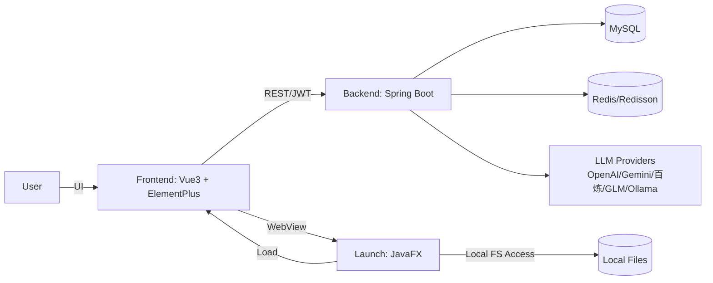
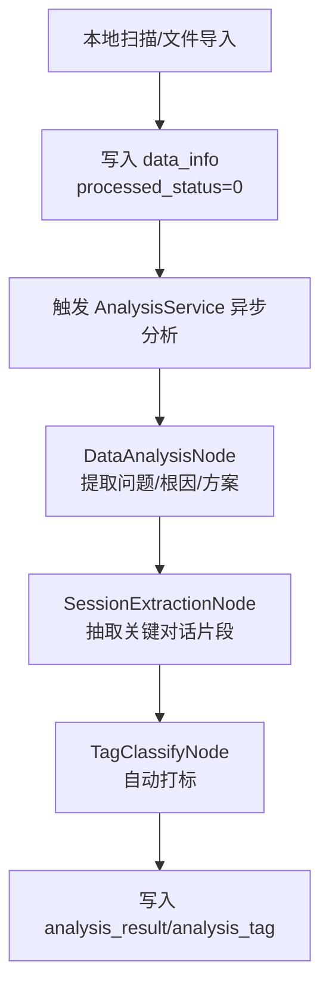
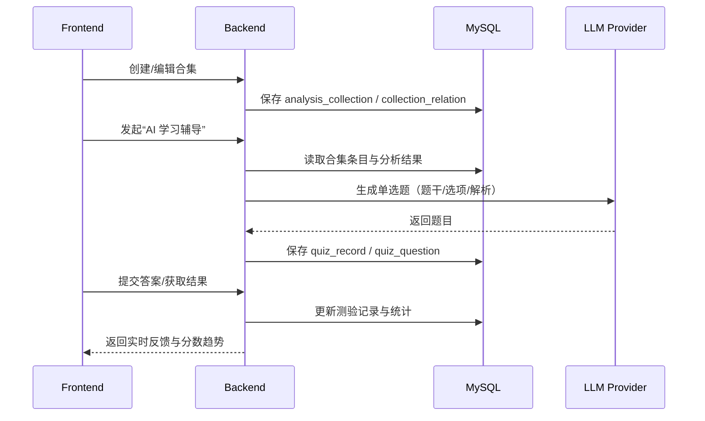

# Review Agent 架构基座（AGENT 文档）

本文件用于为 AI 代理提供项目“长效记忆”：项目边界、分层约束、核心流程、关键数据模型与工程规范。日常开发完成一个功能点后，应同步更新本文件对应章节，确保文档与代码一致。

## 架构版本历史

| 版本 | 日期 | 变更摘要 |
|---|---|---|
| v1.0 | 2026-01-24 ~ 2026-01-31 | AppleStyle 视觉体系演进；学习成就模块落地；后端认证/SSE/线程池/软删除/性能优化 |
| v1.1 | 2026-02-03 | 习题模块页面间距规范化（参考 DataPage 顶栏设计） |
| v1.2 | 2026-02-04 | 错题本模块 UI/UX 深度优化（Glassmorphism + AppleStyle） |
| v1.3 | 2026-02-04 | 趋势分析模块 UI/UX 重构（卡片式布局 + Modern Glass） |
| v1.4 | 2026-02-04 | 习题模块加载体验优化（骨架屏） |
| v1.5 | 2026-02-04 | 题型组件公共代码重构（样式抽取 + Composables + 布局优化） |

## 1. 项目定位与边界

**Review Agent** 是一个辅助开发者复盘技术问题、构建个人技术认知知识库的工具，核心目标是把“即时问答”沉淀为“可检索、可复习”的结构化知识。

### 1.1 核心价值

- 自动扫描并解析本地 AI 聊天记录（文件级数据源）
- 通过 LLM 抽取问题本质、根因、解决方案与关键片段（结构化沉淀）
- 通过标签与合集构建知识体系（组织与复用）
- 基于历史内容生成测验题辅助复习（主动学习闭环）

### 1.2 非目标（当前不做）

- 通用笔记系统或通用知识管理平台
- 复杂的多租户/组织权限体系（以个人使用为主）
- 将 LLM 输出当作“强一致事实源”（结果需可解释与可追溯）

## 2. 技术栈与运行环境

### 2.1 技术栈

- 后端：Java 17+，Spring Boot 3.x，JPA，Lombok
- 数据：MySQL 8.0+，Redis（Redisson）
- AI：MultiLLMConfig（多提供商接入），Spring AI（VectorStore）
- 前端：Vue 3，Vite，Pinia，Vue Router，Element Plus
- 可视化：ECharts，echarts-wordcloud
- Markdown：markdown-it，highlight.js
- 桌面端：JavaFX（WebView 容器 + 本地文件系统访问能力）

## 3. 总体架构

### 3.1 组件关系图



### 3.2 关键约束

- 鉴权：前端仅发送 `Authorization: Bearer <JWT>`，不再发送 `userId` Header；后端统一从 Security Context 获取当前用户 ID（`SecurityUtils.getCurrentUserId()`）。
- 可视化与交互：前端统一遵循 AppleStyle（Modern Glass、无边框输入、圆角、平滑过渡），滚动区域必须使用 CustomScroll/ScrollStack 组件。
- 数据一致性：涉及写操作的 Service 关键方法需显式事务边界（`@Transactional(rollbackFor = Exception.class)`），并遵循软删除约定（见 6.2）。

## 4. 代码结构与分层约束

### 4.1 后端目录职责（backend/）

- `common/`：通用工具、常量、统一异常与响应封装
- `config/`：Spring 配置（LLM、Redis、WebMvc、线程池等）
- `controller/`：REST 接口层，仅做参数校验/组装/调用 Service
- `entity/`：实体/DTO/VO/Request；Entity 与 DTO/VO 边界清晰，避免跨层复用导致污染
- `graph/`：业务流程编排（节点/钩子），用于分析任务链路
- `repository/`：JPA 数据访问层，聚合常用查询与批量操作
- `service/`：核心业务逻辑，承载事务与领域规则
- `schedule/`：定时任务（如 SSE 心跳）

### 4.2 前端目录职责（frontend/src/）

- `api/`：Axios 封装与接口定义
- `components/`：可复用组件（含 CustomScroll、ScrollStack）
- `pages/`：路由页面与页面内组件
- `router/`：路由配置
- `stores/`：Pinia（auth/chat/theme 等）
- `styles/`：全局样式（SCSS）

### 4.3 启动器（launch/）

- JavaFX 应用入口：负责加载 WebView、提供本地文件系统访问与能力桥接（用于扫描导入）

### 4.4 前端组件化与架构规范

**组件化原则**：

| 原则 | 说明 |
|------|------|
| 单一职责 | 每个组件只负责一个功能域，便于测试和维护 |
| 路由优于滚动 | 使用路由切换替代页面内滚动，符合 SPA 最佳实践 |
| Props/Emits 明确 | 组件输入输出清晰，避免直接操作父组件状态 |
| 样式复用 | 公共样式通过全局样式或样式文件复用 |

**目录组织规范**：

```
pages/
├── config/                    # 功能模块目录
│   ├── index.vue              # 布局容器（侧边栏 + router-view）
│   ├── BasicInfoPage.vue      # 独立页面组件
│   ├── ScanConfigPage.vue
│   └── components/           # 模块内共享组件
│       ├── ConfigSidebar.vue   # 可复用组件
│       └── PasswordDialog.vue
├── profile/                   # 另一个功能模块目录
│   ├── index.vue
│   ├── components/
│   └── composables/
└── ...
```

**Vue Router 路由嵌套规范**：

```javascript
{
  path: '/config',
  component: ConfigPage,        // 布局容器
  redirect: '/config/basic',   // 默认子路由
  children: [
    { path: 'basic', component: BasicInfoPage },
    { path: 'scan', component: ScanConfigPage },
    { path: 'push', component: PushConfigPage },
    { path: 'model-provider', component: ModelProviderConfig },
    { path: 'default-model', component: DefaultModelConfig },
    { path: 'about', component: AboutUsPage }
  ]
}
```

**常见陷阱与解决方案**：

| 问题 | 原因 | 解决方案 |
|------|------|----------|
| `onBeforeRouteLeave` 导入错误 | 从 `vue` 导入而非 `vue-router` | `import { onBeforeRouteLeave } from 'vue-router'` |
| v-model 绑定 props 报错 | `v-model="modelValue"` 直接绑定 props 是只读的 | 使用 computed getter/setter |
| 嵌套 ref 属性 v-model 不稳定 | `passwordForm.oldPassword` 嵌套属性 | 为每个字段创建独立 computed |
| API 路径错误 | 移动文件后相对路径变化 | 移动后更新 import 路径 |

**Computed Getter/Setter 模式**：

```vue
<script setup>
const props = defineProps({
  modelValue: {
    type: Boolean,
    default: false
  }
})

const emit = defineEmits(['update:modelValue'])

// Dialog visibility
const dialogVisible = computed({
  get: () => props.modelValue,
  set: (val) => emit('update:modelValue', val)
})

// Form field bindings
const passwordForm = ref({
  oldPassword: '',
  newPassword: '',
  confirm: ''
})

const oldPassword = computed({
  get: () => passwordForm.value.oldPassword,
  set: (val) => passwordForm.value.oldPassword = val
})
</script>

<template>
  <el-dialog v-model="dialogVisible">
    <el-input v-model="oldPassword" />
  </el-dialog>
</template>
```

**路由守卫与状态管理**：

```vue
<script setup>
import { onBeforeRouteLeave } from 'vue-router'
import { ElMessageBox } from 'element-plus'

const originalForm = ref(null)
const form = ref({ /* ... */ })

onMounted(async () => {
  await loadData()
  // 保存原始配置用于变更检测
  originalForm.value = JSON.parse(JSON.stringify(form.value))
})

onBeforeRouteLeave((to, from, next) => {
  if (!originalForm.value) {
    next()
    return
  }

  const normalize = (f) => JSON.stringify(JSON.parse(JSON.stringify(f)))
  if (normalize(form.value) !== normalize(originalForm.value)) {
    ElMessageBox.confirm(
      '您有未保存的更改，确定要离开吗？',
      '未保存更改',
      {
        confirmButtonText: '保存并离开',
        cancelButtonText: '放弃修改',
        distinguishCancelAndClose: true,
        type: 'warning',
      }
    )
      .then(async () => {
        await saveConfig()
        next()
      })
      .catch((action) => {
        if (action === 'cancel') next()
        else next(false)
      })
  } else {
    next()
  }
})
</script>
```

**组件设计最佳实践**：

1. **Props 设计**：明确组件接受的输入参数，使用 TypeScript 或 JSDoc 注释类型
2. **Emits 设计**：明确组件触发的事件，使用 `defineEmits` 声明
3. **默认值处理**：为可选 props 提供合理的默认值
4. **事件命名**：遵循 Vue 3 规范，使用 kebab-case（如 `update:modelValue`）
5. **样式隔离**：使用 `scoped` 或 CSS Modules 避免样式污染

## 5. 核心模块索引（业务视角）

| 模块 | 职责边界 | 核心组件（示例） | 关键数据表 |
|---|---|---|---|
| 文件同步与管理（Sync & Data） | 扫描/导入文件，维护元数据与状态流转 | SyncRecordController，DataInfoService | `data_info`，`sync_record`，`user_config` |
| 智能分析（Analysis） | 异步分析文件，抽取结构化结果与标签 | AnalysisService，DataAnalysisNode，SessionExtractionNode，TagClassifyNode | `analysis_result`，`analysis_tag` |
| 标签与合集（Tags & Collections） | 两级标签体系；合集聚合与条目管理 | TagPage（前端），CollectionService（后端） | `main_tag`，`sub_tag`，`tag_relation`，`analysis_collection`，`collection_relation` |
| AI 学习辅导（Quiz） | 基于合集生成题目、答题与记录 | QuizPage（独立页面），QuestionRenderer（答题组件），QuizService（后端） | `quiz_record`，`quiz_question` |
| 错题本（Mistake Book） | 错题记录、复习推荐、掌握状态追踪 | MistakeBookPage（前端），MistakeBookService（后端） | `quiz_mistake` |
| 报表与统计（Report & Statistics） | 日/周报与可视化统计 | StatisticController，WordCloudPage | `report_data` |
| 系统配置（Config） | 扫描、推送、LLM 提供商配置与默认模型 | ConfigPage，ModelConfig | `user_config`（含扫描路径/开关） |
| 学习成就（Learning Achievements） | 成就定义、用户成就进度与趋势图表 | AchievementDefinition/UserAchievement，UserService.getUserStats | `achievement_definition`，`user_achievement` |

## 6. 核心业务流程（可视化）

### 6.1 文件同步与分析流水线



### 6.2 合集与测验闭环



### 6.3 学习成就计算链路（UserStats）

```mermaid
flowchart LR
  S[getUserStats] --> T[读取 quiz_record/quiz_question]
  T --> A[计算分数趋势]
  T --> B[计算知识点掌握度]
  S --> C[读取 user_achievement/achievement_definition]
  A --> D[checkAndUnlockAchievements]
  B --> D
  D --> E[calculateLearningProgress]
  E --> R[返回 UserStatsVo(成就/趋势/掌握度/进度)]
```

## 7. 数据模型与数据库约定

### 7.1 实体关系（ER 概览）

- User (1) -- (N) DataInfo（文件）
- DataInfo (1) -- (1) AnalysisResult（分析结果）
- AnalysisResult (1) -- (N) AnalysisTag（自动标签）
- AnalysisResult (N) -- (N) AnalysisCollection（合集）
- MainTag (1) -- (N) SubTag（通过 `tag_relation`）
- AnalysisCollection (1) -- (N) QuizRecord（测验记录）
- QuizRecord (1) -- (N) QuizQuestion（题目）
- User (1) -- (N) QuizMistake（错题记录）
- QuizQuestion (1) -- (N) QuizMistake（题目错题）
- User (1) -- (N) UserAchievement（用户成就）
- AchievementDefinition (1) -- (N) UserAchievement（用户成就记录）

### 7.2 软删除约定（核心实体）

软删除覆盖以下核心数据：DataInfo、AnalysisResult、AnalysisCollection、QuizRecord。

- 字段：`deleted`（Boolean），`deleted_at`（时间字段）
- Repository：提供 `softDelete()` / `hardDelete()`；查询默认过滤已删除数据
- Service：提供 `restore()` 支持恢复

## 8. 安全与接口约定

### 8.1 认证与用户上下文

- 前端：只发送 Authorization Header（JWT）
- 后端：Controller 不接收 `@RequestHeader("userId")`；统一注入SecurityUtils Bean使用 `securityUtils.getCurrentUserId()` 方法获取用户

### 8.2 SSE 连接管理

- 使用连接管理器控制并发连接数（上限 1000）
- 连接完成/超时/异常时自动移除，避免内存泄漏
- 心跳任务每 30 秒发送心跳检测

## 9. 前端 AppleStyle 设计规范（精简版）

### 9.1 设计原则

- 简约至上：减少硬边框，突出内容
- 视觉层次：阴影/模糊/透明度构建空间感
- 微交互：平滑过渡与即时反馈
- 深色模式：全链路适配

### 9.2 滚动条规范（强制）

所有需要滚动条的场景必须使用：

- `frontend/src/components/CustomScroll.vue`
- `frontend/src/components/ScrollStack/`

### 9.3 通用样式基准（参考）

动画曲线（Apple Spring）：
`cubic-bezier(0.25, 1, 0.5, 1)` 或更自然的 `cubic-bezier(0.175, 0.885, 0.32, 1.275)`

卡片：

```css
.apple-card {
  background: var(--el-bg-color);
  border-radius: 16px;
  box-shadow: 0 2px 12px rgba(0, 0, 0, 0.08);
  border: 1px solid var(--el-border-color-light);
  backdrop-filter: blur(10px);
  transition: all 0.3s cubic-bezier(0.25, 1, 0.5, 1);
}
```

输入框：

```css
.apple-input {
  background: var(--el-fill-color-light);
  border: none;
  border-radius: 12px;
  padding: 12px 16px;
  transition: all 0.3s ease;
}
```

按钮：

```css
.apple-button {
  border-radius: 20px;
  padding: 10px 24px;
  font-weight: 500;
  transition: all 0.3s cubic-bezier(0.4, 0, 0.2, 1);
}
```

### 9.4 页面布局间距规范（参考 DataPage.vue）

**核心原则**：使用容器级 `gap` 控制间距，而非在子组件中设置 padding，以获得更灵活和统一的布局控制。

**典型页面布局结构**：

```css
/* 1. 页面根容器 - 使用 gap 控制工具栏与内容的间距 */
.page-root {
  display: flex;
  flex-direction: column;
  height: 100vh;
  width: 100vw;
  gap: 16px;           /* 统一的组件间距 */
  padding: 0 4px;      /* 轻微的左右边距 */
  min-height: 0;        /* 关键：确保 flex 子项正确收缩 */
}

/* 2. 顶部工具栏 - 最小垂直 padding */
.toolbar {
  flex-shrink: 0;
  display: flex;
  align-items: center;
  padding: 4px 0;      /* 最小垂直 padding，非 16px+ */
  gap: 16px;
}

/* 3. 内容区域 - 零 padding，依赖容器 gap */
.content-area {
  flex: 1;
  padding: 0;          /* 无 padding，间距由父容器 gap 控制 */
  overflow: hidden;
  min-height: 0;        /* 关键：确保 flex 子项正确收缩 */
}
```

**关键设计决策**：

| 场景 | 推荐值 | 原因 |
|------|--------|------|
| 工具栏垂直 padding | `4px 0` | 最小化留白，保持紧凑 |
| 页面容器 gap | `16px` | 统一的组件间间距 |
| 内容区域 padding | `0` | 依赖容器 gap 控制，避免累积 |
| flex 子项 min-height | `0` | 确保 flex 子项能正确收缩，避免溢出 |

**示例参考**：
- ✅ **正例**：`DataPage.vue` (toolbar: `padding: 4px 0`, content-area: `padding: 0`)
- ✅ **正例**：`quiz/index.vue` (已优化，遵循此规范)
- ❌ **反例**：工具栏使用 `padding: 16px 24px`（过大）+ 内容区域使用 `padding: 16px 24px 24px 24px`（冗余）

### 9.5 深色模式适配规范（强制）

**核心原则**：所有新增组件必须支持深色模式，使用统一的 `html.dark` 选择器策略。

#### 9.5.1 选择器策略（强制）

**统一使用 `html.dark` 选择器**

**理由**：
- 与 `theme.js` 的实现保持一致（`document.documentElement.classList.add('dark')`）
- 与全局样式 `style.scss` 保持一致
- 便于调试和维护（Chrome DevTools 可直接查看 `<html class="dark">`）
- Element Plus 官方推荐方式

**禁止使用的模式**：
```scss
// ❌ 错误：与 theme.js 实现不一致
:global(.dark) & {
  background: var(--el-bg-color);
}

// ❌ 错误：仅支持系统偏好，无法手动切换
@media (prefers-color-scheme: dark) {
  background: var(--el-bg-color);
}
```

**推荐模式**：
```scss
// ✅ 正确：统一使用 html.dark
html.dark .my-component {
  background: rgba(28, 28, 30, 0.75);
  border: 1px solid rgba(255, 255, 255, 0.1);
}

// ✅ 可选：同时支持系统偏好（向后兼容）
@media (prefers-color-scheme: dark) {
  .my-component {
    background: rgba(28, 28, 30, 0.75);
  }
}
```

#### 9.5.2 颜色使用规范（强制）

**必须使用 Element Plus CSS 变量**

| 硬编码值 | 替换为 | 用途 |
|---------|--------|------|
| `rgba(0, 0, 0, 0.04)` | `var(--el-fill-color-light)` | 浅色背景填充 |
| `#1d1d1f` | `var(--el-text-color-primary)` | 主要文本 |
| `#86868b` | `var(--el-text-color-secondary)` | 次要文本 |
| `#f5f5f7` | `var(--el-bg-color-page)` | 页面背景 |

**可以保留的颜色（品牌色/设计色）**：
- `#34c759` (成功绿)
- `#ff3b30` (错误红)
- `#007aff` (主要蓝)
- `rgba(28, 28, 30, 0.75)` (深色玻璃背景)
- `rgba(255, 255, 255, 0.1)` (深色边框)

#### 9.5.3 AppleStyle 玻璃态深色模式模板

**浅色模式**：
```scss
.glass-panel {
  background: rgba(255, 255, 255, 0.72);
  backdrop-filter: blur(24px) saturate(180%);
  border: 1px solid rgba(255, 255, 255, 0.3);
  box-shadow:
    0 4px 24px -1px rgba(0, 0, 0, 0.06),
    0 0 0 1px rgba(255, 255, 255, 0.4) inset;
}
```

**深色模式**：
```scss
html.dark .glass-panel {
  background: rgba(28, 28, 30, 0.75);
  backdrop-filter: blur(24px) saturate(180%);
  border: 1px solid rgba(255, 255, 255, 0.1);
  box-shadow:
    0 8px 32px rgba(0, 0, 0, 0.5),
    0 0 0 1px rgba(255, 255, 255, 0.08) inset;
}
```

#### 9.5.4 完整组件示例

参考修复案例：`frontend/src/pages/quiz/QuizDetailPage.vue`（2026-02-04 修复）

```scss
// 浅色模式基础样式
.quiz-detail-page {
  .statistics-bar {
    background: var(--el-fill-color);
    border-radius: 12px;
    padding: 20px;
  }

  .question-review {
    background: var(--el-bg-color);
    border: 1px solid var(--el-border-color);
  }

  .stat-value {
    color: var(--el-text-color-primary);
  }
}

// 深色模式适配（必须）
html.dark .quiz-detail-page {
  .statistics-bar {
    background: rgba(28, 28, 30, 0.75);
    backdrop-filter: blur(20px) saturate(180%);
    border: 1px solid rgba(255, 255, 255, 0.1);
    box-shadow: 0 4px 16px rgba(0, 0, 0, 0.3);
  }

  .question-review {
    background: rgba(255, 255, 255, 0.05);
    border-color: rgba(255, 255, 255, 0.1);
    box-shadow: 0 2px 12px rgba(0, 0, 0, 0.2);

    &:hover {
      background: rgba(255, 255, 255, 0.08);
    }
  }

  .stat-value {
    color: #ffffff;
  }
}
```

#### 9.5.5 Element Plus 变量速查

**文本颜色**：
```scss
--el-text-color-primary     // 主要文本
--el-text-color-regular     // 常规文本
--el-text-color-secondary   // 次要文本
--el-text-color-placeholder // 占位符
```

**背景颜色**：
```scss
--el-bg-color          // 组件背景
--el-bg-color-page     // 页面背景
```

**填充颜色**：
```scss
--el-fill-color          // 基础填充
--el-fill-color-light    // 浅色填充（推荐用于选项背景）
--el-fill-color-lighter  // 更浅填充
--el-fill-color-dark     // 深色填充
```

**边框颜色**：
```scss
--el-border-color       // 基础边框
--el-border-color-light // 浅色边框
```

#### 9.5.6 常见陷阱（避免）

**陷阱 1：硬编码黑色背景**
```scss
// ❌ 错误：深色模式下不可见
.option-marker {
  background: rgba(0, 0, 0, 0.04);
}

// ✅ 正确：使用 Element Plus 变量
.option-marker {
  background: var(--el-fill-color-light);
}

html.dark .option-marker {
  background: rgba(255, 255, 255, 0.1);
}
```

**陷阱 2：覆盖全局 Element Plus 样式**
```scss
// ❌ 错误：破坏全局主题
.my-component :deep(.el-button) {
  background: #custom-color !important;
}

// ✅ 正确：仅自定义容器
.my-container {
  background: var(--el-fill-color);
}
```

**陷阱 3：选择器不统一**
```scss
// ❌ 错误：混用多种选择器
:global(.dark) & { }
@media (prefers-color-scheme: dark) { }

// ✅ 正确：统一使用 html.dark
html.dark .my-component { }
```

#### 9.5.7 参考案例

**优秀案例**：
- `frontend/src/pages/quiz/index.vue` - 完整的玻璃态深色模式
- `frontend/src/pages/quiz/QuizDetailPage.vue` - 统计栏、题目卡片深色适配
- `frontend/src/components/quiz/SingleChoiceQuestion.vue` - 选项标记深色适配
- `frontend/src/components/quiz/MistakeDrawer.vue` - 完整的深色模式实现

**修复案例（2026-02-04）**：
详见：`docs/2026-02-04-CASE-001-quiz-page-dark-mode-adaptation_01.md`

## 10. 近期变更摘要（沉淀归档）

### 10.1 错题本模块（Mistake Book）- 完整实现
错题本模块**详细文档：** [docs/modules/mistake-book.md](docs/modules/mistake-book.md)

### 10.4 AppleStyle 视觉演进（设置页与全局体验）

- 设置页：分组布局、侧边栏高亮、输入无边框、底部悬浮保存条、离开未保存确认
- 统一：Glassmorphism、圆角、阴影、深浅色自适应

### 10.7 侧边栏与全局样式微调

- **侧边栏优化**：将侧边栏左间距从 20px 收紧至 12px（响应式同步调整），优化空间利用率。
- **全局样式修复**：移除全局 focus outline（黄色边框），修复深色模式下的视觉干扰问题；禁用全局 `html/body` 滚动条，防止双重滚动条问题；实施强力 CSS Reset (`*:focus { outline: none }`) 以彻底消除浏览器默认的焦点高亮。

### 10.8 趋势分析模块（Trends）视觉重构

- **卡片式布局**：将单体大卡片拆分为“学习进度”、“分数趋势”、“知识点掌握度”三个独立 Glass 卡片，提升信息层级与阅读体验。
- **视觉升级**：应用 Modern Glass 参数（White/72% + Blur 24px），增加 Icon Box 渐变色块，优化深色模式下的对比度。
- **响应式优化**：适配移动端布局，进度条与图表在小屏幕下自动堆叠。

### 10.9 习题模块加载体验优化

- **骨架屏（Skeleton Screen）**：将 `QuizHistoryPage` 和 `QuizDetailPage` 的加载状态从简单的 Loading 图标升级为布局保真的骨架屏，提升感知性能和视觉流畅度。
- **一致性**：骨架屏结构严格映射真实内容布局（卡片、统计栏、题目列表），避免加载完成后的布局跳动。

### 10.10 题型组件公共代码重构（样式抽取 + Composables + 布局优化）

#### 10.10.1 背景与问题

在 `frontend/src/components/quiz/` 目录下存在 5 个题型组件（单选、多选、判断、填空、代码题），这些组件之间存在大量重复代码：

| 重复类型 | 重复次数 | 影响 |
|---------|---------|-----|
| CSS 变量定义 | 5 处 | 修改一处需同步修改 5 个文件 |
| 样式类（.knowledge-badge, .explanation-box 等） | ~500 行 | 维护成本高，容易不一致 |
| 动画定义（slideUpFade, shake） | 8 处 | 动画效果不统一 |
| Dark Mode 适配代码 | 5 处 | 深色模式样式不一致 |
| Props 定义 | 10+ 个公共 props | 类型定义分散 |

#### 10.10.2 解决方案

##### 阶段 1：共享样式文件抽取

**新建文件**：

1. **`frontend/src/styles/quiz-variables.scss`**
   - 定义题型组件公共 CSS 变量
   - 包括：`--quiz-card-radius`, `--quiz-transition-spring`, `--quiz-primary-color` 等

2. **`frontend/src/styles/quiz-common.scss`**
   - 导入 `quiz-variables.scss`
   - 包含公共样式类：
     - `.question-header`（题号 + 知识点标签容器）
     - `.knowledge-badge`（知识点标签样式）
     - `.question-number`（题号样式）
     - `.question-text`（题目文本样式）
     - `.explanation-box`（解析框样式）
   - 包含公共动画：`@keyframes slideUpFade`, `@keyframes shake`
   - 包含 Dark Mode 适配基础样式

##### 阶段 2：TypeScript Composables 抽取

**新建文件**：

1. **`frontend/src/composables/useQuestionBase.ts`**
   - 定义 `QuestionBaseProps` 接口（统一 Props 类型）
   - 定义 `QuestionEmits` 接口（统一事件类型）
   - 提供 `useQuestionBase` composable 函数

2. **`frontend/src/composables/useAnswerValidation.ts`**
   - 定义答案验证策略接口
   - 提供默认验证策略（单选、多选、判断、填空）
   - 提供 `useAnswerValidation` composable 函数

#### 10.10.3 组件更新

所有 5 个题型组件均已更新：

| 组件 | 修改内容 |
|------|---------|
| `SingleChoiceQuestion.vue` | 导入 `quiz-common.scss`，移除重复样式 |
| `MultipleChoiceQuestion.vue` | 导入 `quiz-common.scss`，移除重复样式 |
| `TrueFalseQuestion.vue` | 导入 `quiz-common.scss`，移除重复样式 |
| `FillBlankQuestion.vue` | 导入 `quiz-common.scss`，移除重复样式 |
| `CodeSnippetQuestion.vue` | 导入 `quiz-common.scss`，移除重复样式 |

#### 10.10.4 布局优化

1. **题号与知识点标签对齐**
   - 新增 `.question-header` 容器，使题号和知识点标签处于同一水平线
   - 知识点标签位于题号右侧

2. **QuizDetailPage 容器优化**
   - 移除冗余的 `.question-review` 容器（减少视觉噪音）
   - 移除重复的题号显示
   - 优化 `.questions-list` 的 `gap` 和 `padding`

#### 10.10.5 收益指标

| 指标 | 重构前 | 重构后 | 改善 |
|------|-------|-------|-----|
| 重复的 CSS 变量定义 | 5 处 | 1 处 | **-80%** |
| 重复的样式类代码 | ~500 行 | ~100 行 | **-80%** |
| 重复的动画定义 | 8 处 | 2 处 | **-75%** |
| 代码维护成本 | 高 | 低 | 显著降低 |

#### 10.10.6 相关文档

- **详细重构计划**：`.claude/plans/jazzy-conjuring-metcalfe.md`
- **修复案例**：
  - `docs/2026-02-04-CASE-004-fix-questionrenderer-props_01.md`
  - `docs/2026-02-04-CASE-005-mistake-detail-pane-ui-optimization_01.md`
  - `docs/fixes/2026-02-04-CASE-006-fix-quiz-variables-scope_01.md`

#### 10.10.7 验证方法

1. **样式一致性检查**：确认所有题型的知识点标签、题目文本、解析框样式一致
2. **Dark Mode 检查**：切换到暗黑模式，确认所有题型样式正确适配
3. **功能测试**：确认所有题型功能正常，解析显示正常
4. **视觉回归测试**：对比重构前后的页面截图，确保视觉效果一致

---

**状态**：✅ 已完成（2026-02-04）

### 10.11 标签页面（TagPage）图表视图 UI 优化

- **布局重构**：重构“词云分析”与“标签趋势”视图，采用统一的 Header 布局，将 `DateRangeFilter` 与全屏按钮整合至顶部控制栏，消除双重 Header 的视觉冗余。
- **组件通信**：通过 `defineExpose` 暴露子组件（Charts）的全屏控制方法，实现父组件对图表全屏状态的直接管控。
- **视觉一致性**：对齐 Modern Glass 规范，优化 Header 间距与按钮交互样式。
- **全屏体验优化**：在图表全屏模式下，新增悬浮的退出全屏按钮，解决全屏状态下无法退出的问题。
