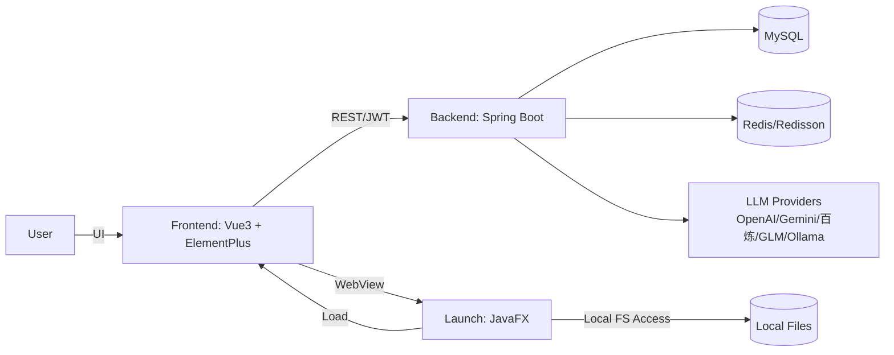
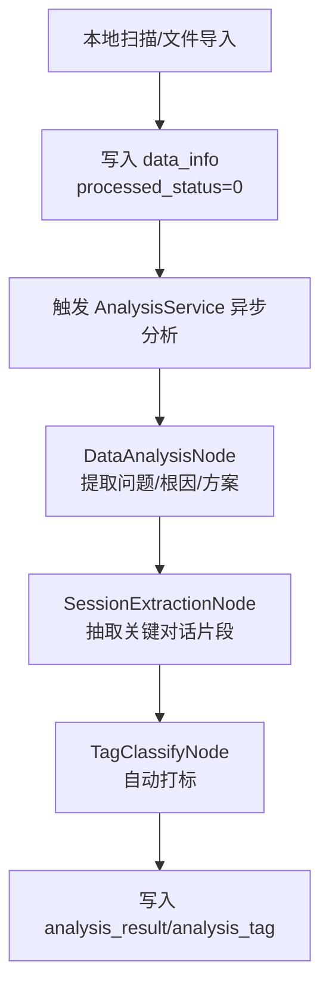
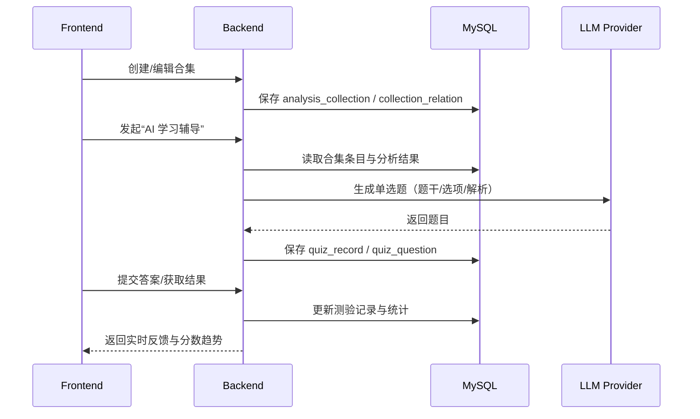

# Review Agent 架构基座（AGENT 文档）

本文件用于为 AI 代理提供项目“长效记忆”：项目边界、分层约束、核心流程、关键数据模型与工程规范。日常开发完成一个功能点后，应同步更新本文件对应章节，确保文档与代码一致。

## 架构版本历史

| 版本 | 日期 | 变更摘要 |
|---|---|---|
| v1.0 | 2026-01-24 ~ 2026-01-31 | AppleStyle 视觉体系演进；学习成就模块落地；后端认证/SSE/线程池/软删除/性能优化 |

## 1. 项目定位与边界

**Review Agent** 是一个辅助开发者复盘技术问题、构建个人技术认知知识库的工具，核心目标是把“即时问答”沉淀为“可检索、可复习”的结构化知识。

### 1.1 核心价值

- 自动扫描并解析本地 AI 聊天记录（文件级数据源）
- 通过 LLM 抽取问题本质、根因、解决方案与关键片段（结构化沉淀）
- 通过标签与合集构建知识体系（组织与复用）
- 基于历史内容生成测验题辅助复习（主动学习闭环）

### 1.2 非目标（当前不做）

- 通用笔记系统或通用知识管理平台
- 复杂的多租户/组织权限体系（以个人使用为主）
- 将 LLM 输出当作“强一致事实源”（结果需可解释与可追溯）

## 2. 技术栈与运行环境

### 2.1 技术栈

- 后端：Java 17+，Spring Boot 3.x，JPA，Lombok
- 数据：MySQL 8.0+，Redis（Redisson）
- AI：MultiLLMConfig（多提供商接入），Spring AI（VectorStore）
- 前端：Vue 3，Vite，Pinia，Vue Router，Element Plus
- 可视化：ECharts，echarts-wordcloud
- Markdown：markdown-it，highlight.js
- 桌面端：JavaFX（WebView 容器 + 本地文件系统访问能力）

### 2.2 运行要求（开发）

- JDK 17+
- Node.js v22+
- MySQL 8.0+
- Redis

## 3. 总体架构

### 3.1 组件关系图



### 3.2 关键约束

- 鉴权：前端仅发送 `Authorization: Bearer <JWT>`，不再发送 `userId` Header；后端统一从 Security Context 获取当前用户 ID（`SecurityUtils.getCurrentUserId()`）。
- 可视化与交互：前端统一遵循 AppleStyle（Modern Glass、无边框输入、圆角、平滑过渡），滚动区域必须使用 CustomScroll/ScrollStack 组件。
- 数据一致性：涉及写操作的 Service 关键方法需显式事务边界（`@Transactional(rollbackFor = Exception.class)`），并遵循软删除约定（见 6.2）。

## 4. 代码结构与分层约束

### 4.1 后端目录职责（backend/）

- `common/`：通用工具、常量、统一异常与响应封装
- `config/`：Spring 配置（LLM、Redis、WebMvc、线程池等）
- `controller/`：REST 接口层，仅做参数校验/组装/调用 Service
- `entity/`：实体/DTO/VO/Request；Entity 与 DTO/VO 边界清晰，避免跨层复用导致污染
- `graph/`：业务流程编排（节点/钩子），用于分析任务链路
- `repository/`：JPA 数据访问层，聚合常用查询与批量操作
- `service/`：核心业务逻辑，承载事务与领域规则
- `schedule/`：定时任务（如 SSE 心跳）

### 4.2 前端目录职责（frontend/src/）

- `api/`：Axios 封装与接口定义
- `components/`：可复用组件（含 CustomScroll、ScrollStack）
- `pages/`：路由页面与页面内组件
- `router/`：路由配置
- `stores/`：Pinia（auth/chat/theme 等）
- `styles/`：全局样式（SCSS）

### 4.3 启动器（launch/）

- JavaFX 应用入口：负责加载 WebView、提供本地文件系统访问与能力桥接（用于扫描导入）

## 5. 核心模块索引（业务视角）

| 模块 | 职责边界 | 核心组件（示例） | 关键数据表 |
|---|---|---|---|
| 文件同步与管理（Sync & Data） | 扫描/导入文件，维护元数据与状态流转 | SyncRecordController，DataInfoService | `data_info`，`sync_record`，`user_config` |
| 智能分析（Analysis） | 异步分析文件，抽取结构化结果与标签 | AnalysisService，DataAnalysisNode，SessionExtractionNode，TagClassifyNode | `analysis_result`，`analysis_tag` |
| 标签与合集（Tags & Collections） | 两级标签体系；合集聚合与条目管理 | TagPage（前端），CollectionService（后端） | `main_tag`，`sub_tag`，`tag_relation`，`analysis_collection`，`collection_relation` |
| AI 学习辅导（Quiz） | 基于合集生成题目、答题与记录 | QuizPage（独立页面），QuestionRenderer（答题组件），QuizService（后端） | `quiz_record`，`quiz_question` |
| 错题本（Mistake Book） | 错题记录、复习推荐、掌握状态追踪 | MistakeBookPage（前端），MistakeBookService（后端） | `quiz_mistake` |
| 报表与统计（Report & Statistics） | 日/周报与可视化统计 | StatisticController，WordCloudPage | `report_data` |
| 系统配置（Config） | 扫描、推送、LLM 提供商配置与默认模型 | ConfigPage，ModelConfig | `user_config`（含扫描路径/开关） |
| 学习成就（Learning Achievements） | 成就定义、用户成就进度与趋势图表 | AchievementDefinition/UserAchievement，UserService.getUserStats | `achievement_definition`，`user_achievement` |

## 6. 核心业务流程（可视化）

### 6.1 文件同步与分析流水线



### 6.2 合集与测验闭环



### 6.3 学习成就计算链路（UserStats）

```mermaid
flowchart LR
  S[getUserStats] --> T[读取 quiz_record/quiz_question]
  T --> A[计算分数趋势]
  T --> B[计算知识点掌握度]
  S --> C[读取 user_achievement/achievement_definition]
  A --> D[checkAndUnlockAchievements]
  B --> D
  D --> E[calculateLearningProgress]
  E --> R[返回 UserStatsVo\n(成就/趋势/掌握度/进度)]
```

## 7. 数据模型与数据库约定

### 7.1 实体关系（ER 概览）

- User (1) -- (N) DataInfo（文件）
- DataInfo (1) -- (1) AnalysisResult（分析结果）
- AnalysisResult (1) -- (N) AnalysisTag（自动标签）
- AnalysisResult (N) -- (N) AnalysisCollection（合集）
- MainTag (1) -- (N) SubTag（通过 `tag_relation`）
- AnalysisCollection (1) -- (N) QuizRecord（测验记录）
- QuizRecord (1) -- (N) QuizQuestion（题目）
- User (1) -- (N) QuizMistake（错题记录）
- QuizQuestion (1) -- (N) QuizMistake（题目错题）
- User (1) -- (N) UserAchievement（用户成就）
- AchievementDefinition (1) -- (N) UserAchievement（用户成就记录）

### 7.2 软删除约定（核心实体）

软删除覆盖以下核心数据：DataInfo、AnalysisResult、AnalysisCollection、QuizRecord。

- 字段：`deleted`（Boolean），`deleted_at`（时间字段）
- Repository：提供 `softDelete()` / `hardDelete()`；查询默认过滤已删除数据
- Service：提供 `restore()` 支持恢复

## 8. 安全与接口约定

### 8.1 认证与用户上下文

- 前端：只发送 Authorization Header（JWT）
- 后端：Controller 不接收 `@RequestHeader("userId")`；统一注入SecurityUtils Bean使用 `securityUtils.getCurrentUserId()` 方法获取用户

### 8.2 SSE 连接管理

- 使用连接管理器控制并发连接数（上限 1000）
- 连接完成/超时/异常时自动移除，避免内存泄漏
- 心跳任务每 30 秒发送心跳检测

## 9. 前端 AppleStyle 设计规范（精简版）

### 9.1 设计原则

- 简约至上：减少硬边框，突出内容
- 视觉层次：阴影/模糊/透明度构建空间感
- 微交互：平滑过渡与即时反馈
- 深色模式：全链路适配

### 9.2 滚动条规范（强制）

所有需要滚动条的场景必须使用：

- `frontend/src/components/CustomScroll.vue`
- `frontend/src/components/ScrollStack/`

### 9.3 通用样式基准（参考）

动画曲线（Apple Spring）：
`cubic-bezier(0.25, 1, 0.5, 1)` 或更自然的 `cubic-bezier(0.175, 0.885, 0.32, 1.275)`

卡片：

```css
.apple-card {
  background: var(--el-bg-color);
  border-radius: 16px;
  box-shadow: 0 2px 12px rgba(0, 0, 0, 0.08);
  border: 1px solid var(--el-border-color-light);
  backdrop-filter: blur(10px);
  transition: all 0.3s cubic-bezier(0.25, 1, 0.5, 1);
}
```

输入框：

```css
.apple-input {
  background: var(--el-fill-color-light);
  border: none;
  border-radius: 12px;
  padding: 12px 16px;
  transition: all 0.3s ease;
}
```

按钮：

```css
.apple-button {
  border-radius: 20px;
  padding: 10px 24px;
  font-weight: 500;
  transition: all 0.3s cubic-bezier(0.4, 0, 0.2, 1);
}
```

## 10. 近期变更摘要（沉淀归档）

### 10.1 错题本模块（Mistake Book）- 完整实现
错题本模块**详细文档：** [docs/modules/mistake-book.md](docs/modules/mistake-book.md)

### 10.2 学习成就模块（迭代 1）

- 数据表：`achievement_definition`（成就定义）、`user_achievement`（用户成就）
- 后端：UserService 增加趋势/掌握度/解锁/进度计算，并在 `getUserStats()` 汇总返回
- 前端：ProfileNav / AchievementsSection / TrendsSection + `useAchievements.js`（图表初始化、主题切换、自适应与释放）

### 10.3 后端架构优化（认证、线程池、SSE、事务、软删除、性能）

- 认证：从 `@RequestHeader("userId")` 迁移为 Security Context（`SecurityUtils.getCurrentUserId()`）
- 线程池：为分析/SSE/默认异步任务提供专用线程池，替换 `new Thread()`，支持优雅关闭
- SSE：连接管理器 + 心跳任务，完善异常清理与连接上限
- 事务：关键写方法增加显式事务边界，保证异常回滚
- 软删除：核心实体统一 `deleted/deleted_at` 与恢复能力
- 性能：消除 N+1，批量查询与 Map 加速路径

### 10.4 AppleStyle 视觉演进（设置页与全局体验）

- 设置页：分组布局、侧边栏高亮、输入无边框、底部悬浮保存条、离开未保存确认
- 统一：Glassmorphism、圆角、阴影、深浅色自适应

### 10.5 成就通知 UI 重构（Apple Style）

- **视觉升级**：采用高通透 Glassmorphism 背景、Mesh Gradient 光效、悬浮图标与微阴影。
- **动画优化**：引入 `spring` 物理动画曲线，替换生硬的 `bounce`；优化进度条填充与卡片入场动画。
- **排版优化**：重构文字层级（Badge/Title/Description），优化按钮交互反馈（Scale/Shadow）。

### 10.6 趋势分析 UI 优化（ui-ux-pro-max）

- **视觉升级**：基于 ui-ux-pro-max 的 "Modern Glass" 建议，优化 TrendsSection 背景模糊度、阴影深度与圆角（24px）。
- **细节打磨**：
  - 进度条升级为 Pill Shape + 渐变填充 + 辉光阴影。
  - 标题字体优化为 System Font Stack，增加 Tracking 与 Drop Shadow。
  - Dark Mode 适配优化，确保磨砂玻璃质感在深色背景下自然过渡。

### 10.7 侧边栏与全局样式微调

- **侧边栏优化**：将侧边栏左间距从 20px 收紧至 12px（响应式同步调整），优化空间利用率。
- **全局样式修复**：移除全局 focus outline（黄色边框），修复深色模式下的视觉干扰问题；禁用全局 `html/body` 滚动条，防止双重滚动条问题；实施强力 CSS Reset (`*:focus { outline: none }`) 以彻底消除浏览器默认的焦点高亮。

### 10.8 深色模式体验重构（High Contrast OLED）

- **背景优化**：全局背景强制为纯黑 (`#000000`)，消除原有灰色调背景的“灰蒙蒙”感，适配 OLED 屏幕。
- **高对比度文字**：主要文字变量 (`--el-text-color-primary`) 强制覆盖为 100% 白色 (`#FFFFFF`)，并使用 `!important` 确保优先级；禁用 `antialiased` 平滑处理，使文字在深色背景下更实更亮。
- **Glass 质感升级**：替换原有的半透明黑色遮罩，采用更具质感的深灰玻璃 (`rgba(28, 28, 30, 0.75)`)，增强层级感与光影反射。
- **边界强化**：卡片与表格增加微弱的白色边框 (`rgba(255, 255, 255, 0.2)`) 与更深的阴影，确保在纯黑背景下元素边界清晰可辨。

### 10.9 AI 学习辅导 UI 重构 (Modern Glass)

- **组件修复**：修复 `QuestionRenderer` 中导致题目组件无法挂载的逻辑错误。
- **Drawer 升级**：应用 `ui-ux-pro-max` 规范，将测验抽屉升级为 Modern Glass 模态风格（Backdrop blur + 半透明背景），适配深色模式。
- **题目卡片优化**：
  - 重构 `SingleChoiceQuestion`，引入 Bento Grid 风格的选项卡片。
  - 增加 Hover Scale、Selected Glow 等微交互动画。
  - 优化进度条为 Pill Shape + 渐变填充。
  - 底部导航按钮升级为大尺寸触控友好型。

### 10.10 AI 学习辅导体验升级与独立页面重构

- **独立页面 (QuizPage)**：从原抽屉式交互升级为独立全屏页面，支持沉浸式学习体验，增加顶部导航与返回交互。
- **Modern Glass UI 全面适配**：
  - **组件升级**：`QuestionRenderer` 及其子组件全面应用 Apple Style 设计（磨砂玻璃、物理动画、无边框设计）。
  - **深色模式 (OLED)**：背景调整为纯黑 (#000000)，优化半透明背景色值 (`rgba(28, 28, 30, 0.75)`)，增强文字对比度与边界清晰度。
- **交互优化**：
  - 进度条与题号常驻显示。
  - 底部控制栏（上一题/下一题）固定悬浮，方便单手操作。
  - 增加重置测验的确认弹窗。

### 10.11 答题页面布局极致优化 (Space Maximization)

- **全屏沉浸式布局**：移除页面级滚动条 (`overflow: hidden`)，采用 Flex 布局确保内容垂直填充 (`height: 100vh`)，消除不必要的留白。
- **空间利用最大化**：
  - 移除容器的最大宽度限制 (`max-width: 1200px` -> `100%`)，使题目与选项在宽屏下充分展开。
  - **简约列表布局**：选项列表回归垂直排列 (`flex-direction: column`)，遵循 AppStyle 简约原则：
    - **去边框化**：移除选项卡边框，改用轻量化背景色 (`var(--el-fill-color-light)`) 区分。
    - **紧凑交互**：减小内边距 (`14px 20px`)，增加微交互动画 (Scale/Color)，提升点击触感。
- **无感滚动体验**：内容区域保留滚动能力但隐藏滚动条 (`scrollbar-width: none`)，提供类似原生 App 的流畅体验。
- **视觉微调**：优化 Padding 与间距，适配不同屏幕尺寸，确保在移动端和桌面端均有最佳阅读体验。

### 10.12 答题解析显示修复与逻辑优化

- **Bug 修复**：修复了 `QuestionRenderer` 在传递状态时漏传 `isSubmitted` 属性，导致提交答案后题目解析 (`explanation-box`) 无法正确显示的 Bug。
- **解析逻辑优化**：
  - 优化了 `FillBlankQuestion` 和 `CodeSnippetQuestion` 的解析显示逻辑，确保无论答题正确与否，只要后端返回了解析内容 (`explanation`) 均会显示。
  - 修复了 `FillBlankQuestion` 中计算变量 (`correctCount`) 未定义的运行时错误。
  - 修复了 `FillBlankQuestion` 判断逻辑错误：原逻辑直接比较单个填空与完整答案字符串，导致多空答案判断恒为 `false`；修复为逐个比较分割后的答案数组。
  - 统一了所有题型组件的解析显示体验：答对显示“答案正确”+解析，答错显示“正确答案”+解析。

### 10.13 答题解析显示逻辑增强与填空题修正

- **解析显示增强**：修复了 `QuizPage` 中 `isSubmitted` 状态在提交后未能正确传递给子组件的问题；通过 `watch` 监听 `isAllSubmitted` 状态变化，确保 `showAnswer` 响应式更新。
- **题目组件稳健性提升**：统一了 `SingleChoiceQuestion`、`MultipleChoiceQuestion` 和 `TrueFalseQuestion` 的解析显示逻辑，移除冗余的 `showExplanation` 判断，并修复了 Vue 3 模板中 `explanation` 属性访问未定义警告（改为 `props.explanation`）。
- **填空题索引修正**：修复了 `FillBlankQuestion` 中索引生成逻辑（从 1 开始改为 0 开始），解决多空填空题验证时的数组越界与正确率计算错误。
- **填空题数据持久化**：修复 `QuizPage` 未监听 `answer-changed` 事件导致填空题答案在页面切换/翻页时丢失的问题。

### 10.14 答题结果页 UI/UX 升级 (Modern Glass)

- **UI 重构**：应用 `ui-ux-pro-max` 标准，重构答题结果弹窗。采用 "Hero Score + Bento Grid" 布局，移除 emoji，使用 Element Plus SVG 图标。
- **动态交互**：根据正确率 (100%/80%/60%/<60%) 展示不同层级的主题色 (Gold/Purple/Blue/Gray) 与庆祝动画 (Pop Spring/Particles)。
- **视觉升级**：
  - **Glassmorphism**：深色模式下采用 `rgba(28, 28, 30, 0.85)` + 高斯模糊。
  - **动画**：引入物理弹簧动画 (`cubic-bezier`) 和粒子旋转效果。
  - **暗黑适配**：优化 OLED 屏幕显示效果，增强光影质感。

### 10.15 学习成就 UI 深度优化 (Modern Glass Pro)

- **深色模式重构 (OLED Ready)**：
  - **背景升级**：从半透明黑升级为高通透深灰玻璃 (`rgba(28, 28, 30, 0.75)`)，增强景深。
  - **文字增强**：强制主要文字为纯白 (`#FFFFFF`)，次要文字为高亮灰 (`rgba(255, 255, 255, 0.7)`)，彻底解决“灰字看不清”问题。
  - **光影质感**：增加微弱的白色内描边 (`1px solid rgba(255, 255, 255, 0.15)`) 和更深的投影 (`box-shadow: 0 8px 32px ...`)，模拟真实玻璃边缘反光。
- **细节打磨**：
  - **进度环**：SVG 路径增加投影 (`drop-shadow`) 和圆角端点 (`stroke-linecap: round`)。
  - **动画**：全局应用 `cubic-bezier(0.25, 1, 0.5, 1)` 物理弹簧曲线。
  - **解锁状态**：优化“未解锁”卡片的视觉降级处理，使其看起来是“被磨砂玻璃遮挡”而非简单的变灰。

## 11. 技术债务（持续维护）

| 优先级 | 债务描述 | 影响范围 | 建议方向 |
|---|---|---|---|
| P2 | 文档与代码一致性缺少自动校验 | 全局 | 增加 CI 校验项（API/表结构/关键流程变更提示） |
