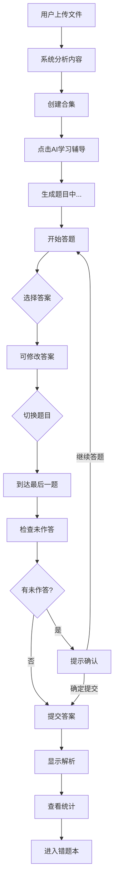
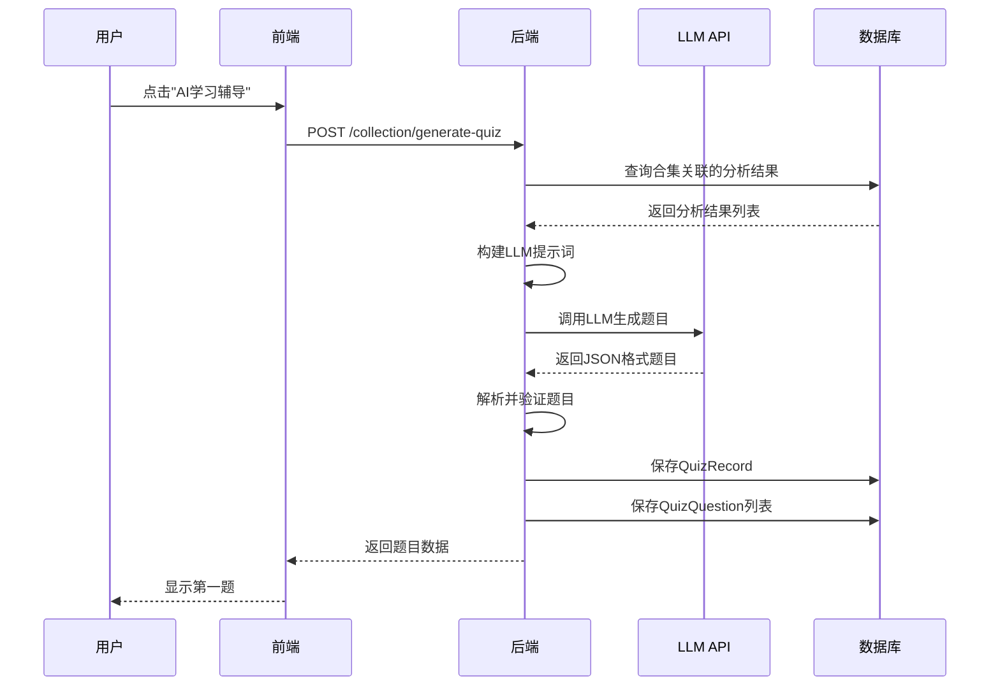
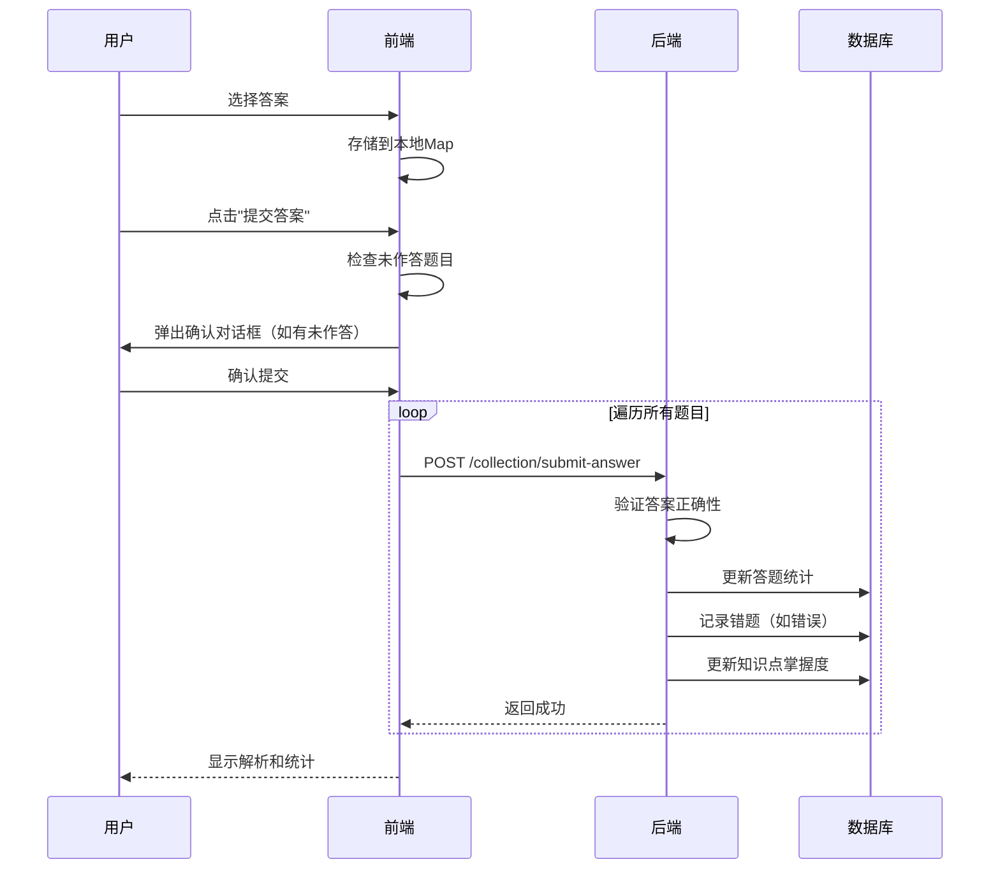

# AI习题系统全功能和流程文档

**文档版本**: v1.0
**创建日期**: 2025-02-02
**作者**: Claude Code
**系统版本**: Phase 2 - Quiz Enhancements

---

## 目录

1. [系统概述](#1-系统概述)
2. [核心功能清单](#2-核心功能清单)
3. [用户使用流程](#3-用户使用流程)
4. [题型详细介绍](#4-题型详细介绍)
5. [技术架构](#5-技术架构)
6. [数据流程](#6-数据流程)
7. [界面交互设计](#7-界面交互设计)
8. [当前限制和已知问题](#8-当前限制和已知问题)
9. [性能指标](#9-性能指标)
10. [优化建议（待填写）](#10-优化建议待填写)

---

## 1. 系统概述

### 1.1 产品定位
AI习题系统是基于用户上传的代码分析记录，利用大语言模型（LLM）智能生成练习题的学习辅导系统。

### 1.2 核心价值
- **智能出题**：根据用户的学习内容自动生成题目
- **多样题型**：支持5种题型覆盖不同学习场景
- **即时反馈**：答题后立即显示解析和正确答案
- **个性化追踪**：记录错题和知识点掌握度
- **灵活交互**：支持答案修改和未作答提醒

### 1.3 系统边界
- **输入**：用户创建的合集及其关联的分析结果
- **处理**：LLM生成题目 → 用户答题 → 答案验证 → 统计分析
- **输出**：答题统计、错题记录、知识点掌握度

---

## 2. 核心功能清单

### 2.1 题目生成功能

| 功能模块 | 功能描述 | 当前状态 |
|---------|---------|---------|
| 智能出题 | 基于分析结果自动生成3-8道题目 | ✅ 已实现 |
| 题型混合 | 单选、多选、判断、填空、代码识别题混合 | ✅ 已实现 |
| 难度自适应 | 根据内容复杂度设置难度等级（1-5） | ✅ 已实现 |
| 知识点标注 | 自动提取知识点并标注 | ✅ 已实现 |
| 时间限制 | 为每道题设置建议答题时间（30-120秒） | ✅ 已实现 |
| 解析生成 | 自动生成详细解析说明 | ✅ 已实现 |
| 关联案例 | 标记题目与原始案例的关联关系 | ✅ 已实现 |

### 2.2 答题交互功能

| 功能模块 | 功能描述 | 当前状态 |
|---------|---------|---------|
| 答案修改 | 提交前可随时修改答案 | ✅ 已实现 |
| 题目导航 | 支持上一题/下一题切换 | ✅ 已实现 |
| 进度追踪 | 垂直进度条显示当前题号 | ✅ 已实现 |
| 未作答检查 | 提交时提示未作答的题目 | ✅ 已实现 |
| 批量提交 | 统一提交所有答案 | ✅ 已实现 |
| 答案解析 | 提交后显示正确答案和解析 | ✅ 已实现 |
| 测验重置 | 清空所有答案重新开始 | ✅ 已实现 |

### 2.3 数据分析功能

| 功能模块 | 功能描述 | 当前状态 |
|---------|---------|---------|
| 答题统计 | 记录每道题的作答次数和正确次数 | ✅ 已实现 |
| 错题本 | 自动收集错题供复习 | 🔄 部分实现 |
| 知识点追踪 | 统计各知识点的掌握度 | 🔄 部分实现 |
| 历史记录 | 保存历次答题记录 | ✅ 已实现 |

### 2.4 界面体验功能

| 功能模块 | 功能描述 | 当前状态 |
|---------|---------|---------|
| 响应式设计 | 支持桌面端、平板、移动端 | ✅ 已实现 |
| 暗黑模式 | 支持亮色/暗色主题切换 | ✅ 已实现 |
| 流畅动画 | 答案切换、题目切换动画效果 | ✅ 已实现 |
| 紧凑模式 | 列表视图的紧凑显示模式 | ✅ 已实现 |
| 玻璃态设计 | 现代化的视觉风格 | ✅ 已实现 |

---

## 3. 用户使用流程

### 3.1 完整学习流程



### 3.2 详细步骤说明

#### 步骤1：准备学习内容
1. 用户上传聊天记录文件
2. 系统自动分析内容，提取问题、根因、解决方案
3. 用户创建合集，选择相关的分析结果
4. 合集必须包含至少1个分析结果

#### 步骤2：进入学习模式
1. 在合集详情页点击"AI学习辅导"按钮
2. 系统检查合集是否有内容
3. 跳转到答题页面

#### 步骤3：生成题目
1. 系统调用LLM API生成题目
2. LLM根据分析结果创建3-8道题目
3. 题目混合5种题型
4. 题目保存到数据库
5. 前端加载第一题

#### 步骤4：答题过程
1. 查看题目内容
2. 选择答案（单选/多选/判断/填空/代码）
3. 可以随时修改答案
4. 切换到其他题目
5. 重复以上过程

#### 步骤5：提交答案
1. 到达最后一题时，显示"提交答案"按钮
2. 系统检查是否有未作答的题目
3. 如有未作答，弹出确认对话框
4. 用户选择"继续答题"或"确定提交"
5. 批量提交所有答案到后端

#### 步骤6：查看结果
1. 显示每道题的正确答案
2. 显示详细解析
3. 标记正确/错误的选项
4. 禁止修改答案
5. 显示"已完成答题"徽章

#### 步骤7：后续学习
1. 查看答题统计
2. 进入错题本复习
3. 查看知识点掌握度
4. 重新开始测验

---

## 4. 题型详细介绍

### 4.1 单选题 (Single Choice)

**适用场景**：测试基本概念和原理

**界面特点**：
- 圆形单选按钮样式
- 选项卡 (A、B、C、D、E、F)
- 选中后背景色高亮
- 提交后显示正确/错误图标

**答案格式**：单个字母（如 "A"）

**验证逻辑**：精确匹配（不区分大小写）

**示例**：
```
问题：以下哪个是 Java 的基本数据类型？
选项：
  A. String
  B. Integer
  C. int
  D. Object
答案：C
```

---

### 4.2 多选题 (Multiple Choice)

**适用场景**：测试多方面知识点

**界面特点**：
- 方形复选框样式
- 可多选，可取消
- 选中数量不限制
- 提交后显示正确/错误/部分正确

**答案格式**：逗号分隔的字母（如 "A,B,D"）

**验证逻辑**：无序集合匹配（顺序不重要）

**示例**：
```
问题：以下哪些是 Java 的特性？（多选）
选项：
  A. 跨平台
  B. 面向对象
  C. 多线程
  D. 指针操作
答案：A,B,C
```

---

### 4.3 判断题 (True/False)

**适用场景**：澄清概念误区

**界面特点**：
- 大卡片设计（YES/NO）
- 颜色区分（绿色/红色）
- 大字体显示
- 双列布局

**答案格式**："true" 或 "false"

**验证逻辑**：布尔值匹配（不区分大小写）

**示例**：
```
问题：Java 是纯面向对象的编程语言。
选项：
  [是 YES]    [否 NO]
答案：false（因为有基本数据类型）
```

---

### 4.4 填空题 (Fill in Blank)

**适用场景**：测试关键术语和参数记忆

**界面特点**：
- 多个输入框
- 自动聚焦下一个
- 显示填空编号
- 输入框等宽字体

**答案格式**：逗号分隔的答案（如 "答案1,答案2"）

**验证逻辑**：不区分大小写的字符串匹配

**示例**：
```
问题：Java 中，_____ 是所有类的父类，_____ 是入口方法。
填空：
  [1] ___________
  [2] ___________
答案：Object,main
```

---

### 4.5 代码识别题 (Code Snippet)

**适用场景**：测试代码分析和调试能力

**界面特点**：
- 代码高亮显示
- 行号标记
- 点击选择代码行
- 错误行高亮

**答案格式**：JSON字符串形式的行信息

**验证逻辑**：根据具体题型定制

**示例**：
```
问题：找出以下代码中的错误行
代码：
  1: public class Test {
  2:   public static void main(String[] args) {
  3:     int x = 10
  4:     System.out.println(x);
  5:   }
  6: }
答案：第3行（缺少分号）
```

---

## 5. 技术架构

### 5.1 系统架构图

```
┌─────────────────────────────────────────────────────────┐
│                     用户界面层                            │
│  ┌──────────────┐  ┌──────────────┐  ┌──────────────┐  │
│  │  合集详情页   │  │   答题页面    │  │   错题本     │  │
│  └──────────────┘  └──────────────┘  └──────────────┘  │
└─────────────────────────────────────────────────────────┘
                            ↓
┌─────────────────────────────────────────────────────────┐
│                    前端组件层 (Vue 3)                     │
│  ┌──────────────┐  ┌──────────────┐  ┌──────────────┐  │
│  │  题目渲染器   │  │  各题型组件   │  │  状态管理     │  │
│  └──────────────┘  └──────────────┘  └──────────────┘  │
└─────────────────────────────────────────────────────────┘
                            ↓
┌─────────────────────────────────────────────────────────┐
│                    API 接口层                            │
│  /collection/generate-quiz  /collection/submit-answer   │
│  /collection/reset                                        │
└─────────────────────────────────────────────────────────┘
                            ↓
┌─────────────────────────────────────────────────────────┐
│                  业务服务层 (Spring Boot)                │
│  ┌──────────────┐  ┌──────────────┐  ┌──────────────┐  │
│  │  QuizService │  │  LLM服务     │  │  统计服务     │  │
│  └──────────────┘  └──────────────┘  └──────────────┘  │
└─────────────────────────────────────────────────────────┘
                            ↓
┌─────────────────────────────────────────────────────────┐
│                    数据访问层                            │
│  ┌──────────────┐  ┌──────────────┐  ┌──────────────┐  │
│  │ QuizRecord   │  │ QuizQuestion │  │ QuizMistake  │  │
│  └──────────────┘  └──────────────┘  └──────────────┘  │
└─────────────────────────────────────────────────────────┘
                            ↓
┌─────────────────────────────────────────────────────────┐
│                    数据存储层                            │
│         MySQL              +           Redis            │
└─────────────────────────────────────────────────────────┘
```

### 5.2 前端技术栈

| 技术 | 版本 | 用途 |
|------|------|------|
| Vue | 3.x | 前端框架 |
| Vite | 7.2.4 | 构建工具 |
| Element Plus | - | UI组件库 |
| Pinia | - | 状态管理 |
| Vue Router | - | 路由管理 |
| Axios | - | HTTP客户端 |
| SCSS | - | CSS预处理器 |

### 5.3 后端技术栈

| 技术 | 版本 | 用途 |
|------|------|------|
| Java | 17+ | 编程语言 |
| Spring Boot | - | 应用框架 |
| Spring Data JPA | - | ORM框架 |
| MySQL | 8.0+ | 关系数据库 |
| Redis | - | 缓存数据库 |
| LLM SDK | - | 多LLM提供商适配 |

---

## 6. 数据流程

### 6.1 题目生成数据流



### 6.2 答题提交数据流



### 6.3 数据库关系

```
user_info (用户表)
    ↓
analysis_collection (合集表)
    ↓
analysis_result (分析结果表)
    ↓
quiz_record (测验记录表)
    ↓
quiz_question (题目表)
    ↓
quiz_mistake (错题本表) ← 外键关联 question_id

knowledge_mastery (知识点掌握度表) ← 独立表，通过 knowledge_point 关联
```

---

## 7. 界面交互设计

### 7.1 答题页面布局

```
┌──────────────────────────────────────────────────────┐
│  [返回合集]  AI学习辅导  [合集名称]        [重新开始] │  ← 顶部导航
├──────────────────────────────────────────────────────┤
│                                                      │
│   ┌────────────────────────────────────────────┐    │
│   │                                            │    │
│   │           题目内容区域                     │    │
│   │                                            │    │
│   │           【题目渲染器】                   │    │
│   │                                            │    │
│   └────────────────────────────────────────────┘    │
│                                                      │
│             [上一题]  [提交答案]  [下一题]            │  ← 底部控制
│                                                      │
│                                             3 / 10   │  ← 进度指示
│                                             ██       │  ← 进度条
└──────────────────────────────────────────────────────┘
```

### 7.2 交互状态流转

```
未作答状态
    ↓
选择答案（本地存储）
    ↓
已选择未提交状态（可修改）
    ↓
切换题目（答案保持）
    ↓
到达最后一题（显示提交按钮）
    ↓
检查未作答
    ↓
[有未作答] → 弹出确认 → [继续答题] / [确定提交]
[无未作答] → 直接提交
    ↓
批量提交到后端
    ↓
已提交状态（显示解析，禁止修改）
```

### 7.3 视觉反馈设计

| 状态 | 选项背景 | 文字颜色 | 图标 | 动画 |
|------|---------|---------|------|------|
| 默认 | 灰色浅背景 | 黑色 | 无 | 无 |
| 悬停 | 灰色背景 | 黑色 | 无 | 放大1.01倍 |
| 选中 | 蓝色浅背景 | 蓝色 | 无 | 无阴影 |
| 正确 | 绿色浅背景 | 深绿 | ✓ | 无 |
| 错误 | 红色浅背景 | 红色 | ✗ | 抖动动画 |

---

## 8. 当前限制和已知问题

### 8.1 功能限制

| 限制项 | 描述 | 影响 | 计划 |
|-------|------|------|------|
| 答案草稿 | 刷新页面后答案丢失 | 用户体验 | 中优先级 |
| 题目数量 | 固定3-8道，用户不可调整 | 灵活性 | 低优先级 |
| 题型比例 | 自动混合，用户不可选择 | 定制性 | 低优先级 |
| 错题本 | 后端已实现，前端未展示 | 功能完整性 | 高优先级 |
| 知识点统计 | 后端已实现，前端未展示 | 功能完整性 | 高优先级 |

### 8.2 技术限制

| 限制项 | 描述 | 影响 | 计划 |
|-------|------|------|------|
| LLM依赖 | 题目质量依赖LLM输出 | 题目质量 | 持续优化 |
| JSON解析 | LLM返回格式不稳定 | 生成失败率 | 持续优化 |
| 并发控制 | 未实现答题并发锁 | 数据一致性 | 中优先级 |
| 缓存策略 | 未使用Redis缓存 | 性能 | 中优先级 |

### 8.3 已知问题

| 问题ID | 问题描述 | 严重程度 | 状态 |
|-------|---------|---------|------|
| ISSUE-001 | 填空题输入框在暗黑模式下对比度不足 | 中 | 待修复 |
| ISSUE-002 | 多选题选中项过多时显示溢出 | 低 | 待修复 |
| ISSUE-003 | 切换题目时偶尔出现闪烁 | 低 | 待修复 |
| ISSUE-004 | 提交按钮在移动端点击区域偏小 | 中 | 待修复 |

---

## 9. 性能指标

### 9.1 当前性能

| 指标 | 数值 | 测量条件 |
|------|------|---------|
| 题目生成时间 | 5-15秒 | 5道题，LLM API响应 |
| 答题提交时间 | 1-3秒 | 5道题批量提交 |
| 页面加载时间 | <1秒 | 首屏渲染 |
| 题目切换延迟 | <100ms | 本地状态切换 |
| 内存占用 | ~50MB | 答题页面 |

### 9.2 并发能力

| 指标 | 数值 | 备注 |
|------|------|------|
| 同时答题用户 | 未测试 | 需压测 |
| 数据库连接池 | 10 | 默认配置 |
| LLM API限流 | 依提供商 | 需配置 |

---

## 10. 优化建议（待填写）

### 10.1 功能优化

**请您根据以上文档填写优化建议**：
按照优先级顺序逐步实现

### 10.2 体验优化
暂时不需要优化

### 10.3 技术优化
优化LLM提示词，提高题目质量和解析准确性，以及返回格式的稳定性。
参考[PromptService.java](../backend/src/main/java/com/review/agent/service/PromptService.java) 中如何调用提示词模版
并将答题提示词抽出来写在[prompt](../backend/src/main/resources/prompts)目录下

### 10.4 其他建议
无

---

## 附录

### A. 相关文档

- [答题逻辑重构总结](./fixes/2025-02-02-CASE-001-答题逻辑重构总结_01.md)
- [答题逻辑重构测试](./testing/2025-02-02-CASE-001-答题逻辑重构测试_01.md)
- [CLAUDE.md](../CLAUDE.md) - 开发指南
- [AGENTS.md](../AGENTS.md) - 架构文档

### B. 代码文件索引

**前端核心文件**：
- `frontend/src/pages/QuizPage.vue` - 答题页面主逻辑
- `frontend/src/components/quiz/QuestionRenderer.vue` - 题目统一渲染器
- `frontend/src/components/quiz/SingleChoiceQuestion.vue` - 单选题组件
- `frontend/src/components/quiz/MultipleChoiceQuestion.vue` - 多选题组件
- `frontend/src/components/quiz/TrueFalseQuestion.vue` - 判断题组件
- `frontend/src/components/quiz/FillBlankQuestion.vue` - 填空题组件
- `frontend/src/components/quiz/CodeSnippetQuestion.vue` - 代码识别题组件

**后端核心文件**：
- `backend/src/main/java/com/review/agent/controller/QuizController.java` - 答题接口
- `backend/src/main/java/com/review/agent/service/QuizService.java` - 答题业务逻辑
- `backend/src/main/java/com/review/agent/entity/pojo/QuizRecord.java` - 测验记录实体
- `backend/src/main/java/com/review/agent/entity/pojo/QuizQuestion.java` - 题目实体

### C. 数据库表结构

详见 `backend/src/main/resources/migration_quiz_enhancements.sql`

---

**文档结束**

**请您审阅以上内容，在"第10节 优化建议"中填写您的想法和改进点。**
