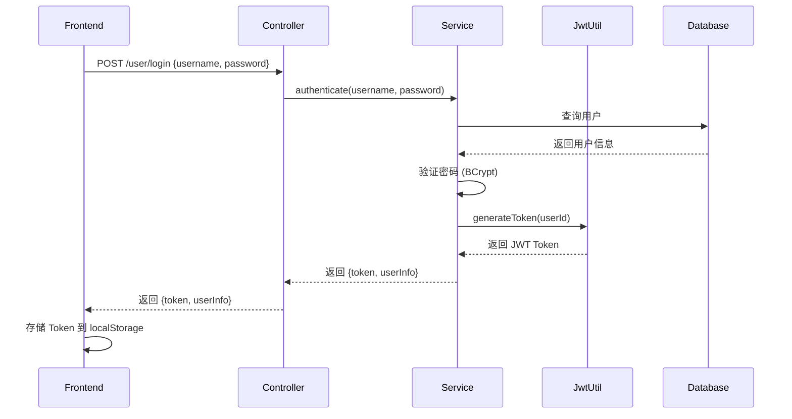
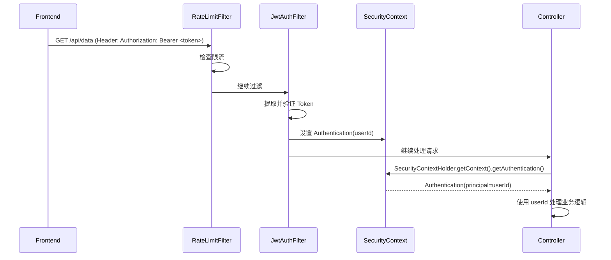

# Spring Security 认证体系改造指南

> 本文档详细讲解 Spring Security 的工作原理，以及如何将 `@RequestHeader("userId")` 替换为从 `SecurityContext` 获取用户信息。

---

## 📚 目录

1. [核心概念](#1-核心概念)
2. [Spring Security 工作原理](#2-spring-security-工作原理)
3. [当前项目的认证架构](#3-当前项目的认证架构)
4. [完整请求流程](#4-完整请求流程)
5. [代码改造指南](#5-代码改造指南)
6. [常见问题](#6-常见问题)
7. [最佳实践](#7-最佳实践)

---

## 1. 核心概念

### 1.1 什么是 Spring Security？

Spring Security 是一个强大的、高度可定制的**认证和访问控制框架**。它保护基于 Spring 的应用程序，提供了：

- ✅ **认证（Authentication）**：验证"你是谁"
- ✅ **授权（Authorization）**：验证"你能做什么"
- ✅ **防护**：防止 CSRF、Session 固化等攻击

### 1.2 核心组件

| 组件 | 作用 | 理解为 |
|------|------|--------|
| **SecurityContext** | 存储当前用户的认证信息 | "当前会话的保险箱" |
| **Authentication** | 认证对象，包含用户信息 | "用户身份证" |
| **SecurityContextHolder** | 管理 SecurityContext | "保险箱的管家" |
| **FilterChain** | 过滤器链，处理每个请求 | "安检流水线" |
| **UserDetails** | 用户详细信息 | "用户档案" |

### 1.3 核心关系图

```
┌─────────────────────────────────────────┐
│   SecurityContextHolder (静态工具类)     │
│   ┌───────────────────────────────────┐ │
│   │  SecurityContext (当前线程上下文)  │ │
│   │  ┌───────────────────────────────┐ │ │
│   │  │  Authentication (认证对象)     │ │ │
│   │  │  - principal: 用户信息        │ │ │
│   │  │  - credentials: 凭证(密码等)  │ │ │
│   │  │  - authorities: 权限列表      │ │ │
│   │  └───────────────────────────────┘ │ │
│   └───────────────────────────────────┘ │
└─────────────────────────────────────────┘
```

---

## 2. Spring Security 工作原理

### 2.1 过滤器链（Filter Chain）

Spring Security 通过一系列过滤器处理每个 HTTP 请求：

```
HTTP 请求
    ↓
[RateLimitFilter]        → 限流检查
    ↓
[JwtAuthenticationFilter] → JWT 验证 & 设置认证信息
    ↓
[UsernamePasswordAuthenticationFilter] → 处理登录
    ↓
[SecurityContextPersistenceFilter] → 持久化 SecurityContext
    ↓
[其他过滤器...]           → CSRF、CORS 等
    ↓
[ExceptionTranslationFilter] → 异常处理
    ↓
[FilterSecurityInterceptor] → 权限检查
    ↓
Controller 方法
```

### 2.2 SecurityContext 的线程隔离

**关键点：** `SecurityContextHolder` 使用 `ThreadLocal` 存储上下文，每个请求线程有独立的上下文。

```java
// 默认策略：ThreadLocalSecurityContextHolderStrategy
// - 每个线程独立的 SecurityContext
// - 请求结束后自动清理（由过滤器链管理）
```

### 2.3 认证流程

```
1. 用户登录
   ↓
2. UserService.authenticate()
   - 验证用户名密码
   - 生成 JWT Token
   ↓
3. 前端存储 Token
   ↓
4. 后续请求携带 Token (Authorization: Bearer <token>)
   ↓
5. JwtAuthenticationFilter 拦截
   - 提取 Token
   - 验证 Token
   - 创建 Authentication 对象
   - 设置到 SecurityContext
   ↓
6. Controller 获取用户信息
   - SecurityContextHolder.getContext().getAuthentication()
```

---

## 3. 当前项目的认证架构

### 3.1 配置文件：SecurityConfig.java

```java
@Configuration
@EnableWebSecurity              // 启用 Spring Security
@EnableMethodSecurity          // 启用方法级安全注解 (@PreAuthorize)
public class SecurityConfig {

    // 1. 密码加密器
    @Bean
    public PasswordEncoder passwordEncoder() {
        return new BCryptPasswordEncoder(); // BCrypt 算法
    }

    // 2. 过滤器链配置
    @Bean
    public SecurityFilterChain securityFilterChain(HttpSecurity http) {
        http
            .csrf(AbstractHttpConfigurer::disable)              // 禁用 CSRF（JWT 无需）
            .sessionManagement(session ->
                session.sessionCreationPolicy(SessionCreationPolicy.STATELESS) // 无状态
            )
            .cors(Customizer.withDefaults())                     // 启用 CORS
            .exceptionHandling(exception ->
                exception.authenticationEntryPoint(jwtAuthenticationEntryPoint) // 401 处理
            )
            .authorizeHttpRequests(authorize -> authorize
                .requestMatchers(
                    "/user/login",
                    "/user/register",
                    "/user/forgot-password",
                    "/api/user/login",
                    "/api/user/register",
                    "/api/user/forgot-password",
                    "/error"
                ).permitAll()  // 允许匿名访问
                .anyRequest().authenticated()  // 其他需要认证
            )
            .addFilterBefore(rateLimitFilter, UsernamePasswordAuthenticationFilter.class)      // 限流过滤器
            .addFilterBefore(jwtAuthenticationFilter, UsernamePasswordAuthenticationFilter.class); // JWT 过滤器
        return http.build();
    }
}
```

### 3.2 JWT 认证过滤器：JwtAuthenticationFilter.java

```java
public class JwtAuthenticationFilter extends OncePerRequestFilter {

    @Override
    protected void doFilterInternal(
        HttpServletRequest request,
        HttpServletResponse response,
        FilterChain filterChain
    ) {
        // 1. 从请求头提取 Token
        String jwt = extractJwtFromRequest(request);  // Authorization: Bearer <token>

        // 2. 验证 Token
        if (StringUtils.hasText(jwt) && jwtUtil.validateToken(jwt)) {
            Long userId = jwtUtil.getUserIdFromToken(jwt);

            // 3. 创建 Authentication 对象
            //   - principal: userId (用户信息)
            //   - credentials: null (不需要密码)
            //   - authorities: null (当前未使用权限)
            UsernamePasswordAuthenticationToken authentication =
                new UsernamePasswordAuthenticationToken(userId, null, null);
            authentication.setDetails(new WebAuthenticationDetailsSource().buildDetails(request));

            // 4. 设置到 SecurityContext (关键步骤)
            SecurityContextHolder.getContext().setAuthentication(authentication);
        }

        // 5. 继续过滤器链
        filterChain.doFilter(request, response);
    }
}
```

### 3.3 Security 工具类：SecurityUtils.java

```java
public class SecurityUtils {

    /**
     * 从 SecurityContext 获取当前用户 ID
     */
    public static Long getCurrentUserId() {
        // 1. 获取 SecurityContext
        SecurityContext context = SecurityContextHolder.getContext();

        // 2. 获取 Authentication 对象
        Authentication authentication = context.getAuthentication();

        // 3. 检查是否已认证
        if (authentication == null || !authentication.isAuthenticated()) {
            return null;
        }

        // 4. 获取 principal（在 JwtAuthenticationFilter 中设置的是 userId）
        Object principal = authentication.getPrincipal();

        if (principal instanceof Long) {
            return (Long) principal;
        }

        return null;
    }

    /**
     * 检查当前用户是否已认证
     */
    public static boolean isAuthenticated() {
        Authentication authentication = SecurityContextHolder.getContext().getAuthentication();
        return authentication != null
            && authentication.isAuthenticated()
            && !"anonymousUser".equals(authentication.getPrincipal());
    }
}
```

---

## 4. 完整请求流程

### 4.1 登录流程（设置认证）



### 4.2 认证请求流程（获取认证）



### 4.3 时序图：从请求到获取 userId

```
时间轴 →

T0: HTTP 请求到达
    ↓
T1: RateLimitFilter 执行（检查限流）
    ↓
T2: JwtAuthenticationFilter 执行
    - 从 Header 提取: Authorization: Bearer eyJhbGc...
    - 验证 Token 签名和有效期
    - 解析出 userId = 123
    - 创建 Authentication(123, null, null)
    - 设置到 SecurityContext
    ↓
T3: 请求到达 Controller
    - Spring 调用某个 Controller 方法
    ↓
T4: Controller 获取用户 ID
    方法 A: @RequestHeader("userId") Long userId  ← 旧方式
    方法 B: SecurityUtils.getCurrentUserId()    ← 新方式
    ↓
T5: Controller 调用 Service
    - 传递 userId
    - 执行业务逻辑
    ↓
T6: 返回响应
    ↓
T7: SecurityContextHolder 自动清理（线程结束）
```

---

## 5. 代码改造指南

### 5.1 改造前 vs 改造后

#### ❌ 旧方式：从请求头获取

```java
@RestController
@RequestMapping("/api/tags")
public class TagController {

    @PostMapping("/add-recommend")
    public BaseResponse<Void> addRecommendTag(
        @RequestHeader("userId") Long userId,  // ← 从请求头获取
        @RequestBody TagRecommendRequest request
    ) {
        // 使用 userId
        tagService.addRecommendTag(userId, request.getTags());
        return BaseResponse.success();
    }
}
```

#### ✅ 新方式：从 SecurityContext 获取

```java
@RestController
@RequestMapping("/api/tags")
public class TagController {

    @PostMapping("/add-recommend")
    public BaseResponse<Void> addRecommendTag(
        @RequestBody TagRecommendRequest request
    ) {
        // 直接从 SecurityContext 获取
        Long userId = SecurityUtils.getCurrentUserId();
        tagService.addRecommendTag(userId, request.getTags());
        return BaseResponse.success();
    }
}
```

### 5.2 改造步骤

#### 步骤 1：移除 Controller 方法的 `@RequestHeader("userId")` 参数

```java
// 改造前
public BaseResponse<List<MainTag>> mainTagList(@RequestHeader("userId") Long userId) {
    // ...
}

// 改造后
public BaseResponse<List<MainTag>> mainTagList() {
    // ...
}
```

#### 步骤 2：在方法内部使用 `SecurityUtils.getCurrentUserId()` 获取用户 ID

```java
// 改造后
public BaseResponse<List<MainTag>> mainTagList() {
    Long userId = SecurityUtils.getCurrentUserId();  // 获取当前用户 ID
    // 业务逻辑...
}
```

#### 步骤 3：完整改造示例

**TagController.java 改造示例：**

```java
// ============ 改造前 ============
@RestController
@RequestMapping("/api/tags")
public class TagController {

    @PostMapping("/add-recommend")
    public BaseResponse<Void> addRecommendTag(
        @RequestHeader("userId") Long userId,
        @RequestBody TagRecommendRequest request
    ) {
        tagService.addRecommendTag(userId, request.getTags());
        return BaseResponse.success();
    }

    @GetMapping("/main")
    public BaseResponse<List<MainTag>> mainTagList(@RequestHeader("userId") Long userId) {
        List<MainTag> tags = tagService.getMainTags(userId);
        return BaseResponse.success(tags);
    }
}

// ============ 改造后 ============
@RestController
@RequestMapping("/api/tags")
public class TagController {

    @PostMapping("/add-recommend")
    public BaseResponse<Void> addRecommendTag(@RequestBody TagRecommendRequest request) {
        Long userId = SecurityUtils.getCurrentUserId();  // ← 新增
        tagService.addRecommendTag(userId, request.getTags());
        return BaseResponse.success();
    }

    @GetMapping("/main")
    public BaseResponse<List<MainTag>> mainTagList() {
        Long userId = SecurityUtils.getCurrentUserId();  // ← 新增
        List<MainTag> tags = tagService.getMainTags(userId);
        return BaseResponse.success(tags);
    }
}
```

### 5.3 需要改造的文件清单

根据代码扫描，以下文件需要改造：

| 文件路径 | 改造次数 | 说明 |
|---------|---------|------|
| `TagController.java` | 8 次 | 标签管理相关接口 |
| `QuizController.java` | 1 次 | 测验生成接口 |
| `CollectionController.java` | 8 次 | 合集管理相关接口 |
| **总计** | **17 次** | |

### 5.4 批量改造技巧

#### 技巧 1：使用 IDE 的重构功能

**IntelliJ IDEA:**
1. 光标放在 `@RequestHeader("userId") Long userId` 上
2. 按 `Alt + Enter` → "Remove parameter"
3. 在方法内添加 `Long userId = SecurityUtils.getCurrentUserId();`

**VS Code:**
1. 使用正则替换（慎用）：
   - 查找：`@RequestHeader\("userId"\) Long userId, `
   - 替换：`(空字符串)`
2. 手动在方法内添加 `Long userId = SecurityUtils.getCurrentUserId();`

#### 技巧 2：创建一个基类 Controller

```java
public abstract class BaseController {

    /**
     * 获取当前用户 ID（包装 SecurityUtils）
     */
    protected Long getCurrentUserId() {
        Long userId = SecurityUtils.getCurrentUserId();
        if (userId == null) {
            throw new UnauthorizedException("用户未登录");
        }
        return userId;
    }
}

// 子类使用
@RestController
@RequestMapping("/api/tags")
public class TagController extends BaseController {

    @GetMapping("/main")
    public BaseResponse<List<MainTag>> mainTagList() {
        Long userId = getCurrentUserId();  // 更简洁
        List<MainTag> tags = tagService.getMainTags(userId);
        return BaseResponse.success(tags);
    }
}
```

### 5.5 Service 层也需要改造吗？

**不需要！** 原因：

1. Service 层不应该依赖 HTTP 相关的东西（@RequestHeader 是 HTTP 概念）
2. Service 方法通过参数接收 userId，这是良好的设计：
   ```java
   // Service 层（无需改动）
   @Service
   public class TagService {

       public List<MainTag> getMainTags(Long userId) {
           // 业务逻辑
           return tagRepository.findByUserId(userId);
       }
   }
   ```

3. Controller 层负责从 SecurityContext 获取 userId，然后传递给 Service

---

## 6. 常见问题

### Q1: SecurityUtils.getCurrentUserId() 返回 null 怎么办？

**原因：**
- 用户未登录（未携带 Token）
- Token 已过期
- Token 签名验证失败
- 请求路径未经过 JwtAuthenticationFilter

**排查步骤：**

1. 检查请求是否携带 Authorization Header：
   ```bash
   curl -H "Authorization: Bearer <token>" http://localhost:8080/api/data
   ```

2. 检查 SecurityConfig 是否正确配置：
   ```java
   .addFilterBefore(jwtAuthenticationFilter,
                    UsernamePasswordAuthenticationFilter.class)
   ```

3. 添加日志调试：
   ```java
   Authentication auth = SecurityContextHolder.getContext().getAuthentication();
   log.debug("Authentication: {}", auth);
   log.debug("Principal: {}", auth != null ? auth.getPrincipal() : "null");
   ```

### Q2: 在 @Async 或多线程环境下获取 userId 失败

**原因：** SecurityContextHolder 默认使用 `ThreadLocal`，子线程无法继承父线程的上下文。

**解决方案：**

**方案 1：在父线程获取后传递（推荐）**
```java
@Async
public void asyncProcess(Long analysisId, Long userId) {
    // userId 由父线程传递过来
    // 在 Controller 中：SecurityUtils.getCurrentUserId()
}
```

**方案 2：使用 MODE_INHERITABLETHREADLOCAL**
```java
// 在 SecurityConfig 中配置
@Bean
public SecurityContextHolderStrategy securityContextHolderStrategy() {
    return SecurityContextHolder
        .createStrategy("MODE_INHERITABLETHREADLOCAL");
}
```

**方案 3：手动传递（最可靠）**
```java
// Controller
Long userId = SecurityUtils.getCurrentUserId();
CompletableFuture.runAsync(() -> {
    // 使用 userId
});
```

### Q3: @PreAuthorize 注解不生效

**原因：** 未启用方法级安全。

**解决方案：**
```java
@Configuration
@EnableWebSecurity
@EnableMethodSecurity  // ← 必须添加这个注解！
public class SecurityConfig {
    // ...
}
```

**使用示例：**
```java
@PreAuthorize("hasRole('ADMIN')")  // 需要 ADMIN 角色
public void adminMethod() { }

@PreAuthorize("#userId == authentication.principal")  // 参数匹配
public void getUserData(Long userId) { }
```

### Q4: 如何获取更详细的用户信息？

**当前实现：** principal 直接存储 Long userId

**扩展方案：创建自定义 UserDetails**

```java
// 1. 创建 UserDetails 实现
public class CustomUserDetails implements UserDetails {

    private final Long userId;
    private final String username;
    private final Set<String> roles;

    // 构造方法、getters...
}

// 2. 在 JwtAuthenticationFilter 中创建
CustomUserDetails userDetails = new CustomUserDetails(userId, username, roles);
UsernamePasswordAuthenticationToken authentication =
    new UsernamePasswordAuthenticationToken(userDetails, null, authorities);

// 3. 在 SecurityUtils 中获取
public static CustomUserDetails getCurrentUser() {
    Authentication auth = SecurityContextHolder.getContext().getAuthentication();
    return (CustomUserDetails) auth.getPrincipal();
}

// 4. 在 Controller 中使用
CustomUserDetails user = SecurityUtils.getCurrentUser();
String username = user.getUsername();
Set<String> roles = user.getRoles();
```

### Q5: 前端还需要传 userId 吗？

**答案：不再需要！**

改造完成后，前端只需携带 Token 即可：

```javascript
// 改造后的前端代码（http.js）
request({
  url: '/api/data',
  headers: {
    'Authorization': `Bearer ${token}`  // ← 只需要传 Token
  }
})
```

```javascript
// ❌ 旧方式（可以删除）
headers: {
  'Authorization': `Bearer ${token}`,
  'userId': userId  // ← 不再需要
}
```

### Q6: Token 过期后如何自动刷新？

**当前实现：** Token 过期需要重新登录

**扩展方案：使用 Refresh Token**

```java
// 1. 登录时返回两个 Token
public class LoginResponseVo {
    private String accessToken;   // 短期（如 15 分钟）
    private String refreshToken;  // 长期（如 7 天）
}

// 2. 前端在 accessToken 过期时调用刷新接口
@PostMapping("/refresh")
public BaseResponse<String> refreshToken(@RequestBody String refreshToken) {
    // 验证 refreshToken
    // 生成新的 accessToken
    // 返回新 accessToken
}

// 3. 前端自动刷新
axios.interceptors.response.use(
  response => response,
  async error => {
    if (error.response.status === 401) {
      // 自动刷新 Token 并重试
      const newToken = await refreshToken();
      error.config.headers.Authorization = `Bearer ${newToken}`;
      return axios.request(error.config);
    }
  }
);
```

---

## 7. 最佳实践

### 7.1 认证 vs 授权

| 概念 | 目的 | Spring Security 实现 |
|------|------|---------------------|
| **认证（Authentication）** | 确认"你是谁" | `SecurityContext.getAuthentication()` |
| **授权（Authorization）** | 确认"你能做什么" | `@PreAuthorize`, `@Secured` |

### 7.2 何时使用 SecurityUtils？

**✅ 使用场景：**
- Controller 层获取当前用户 ID
- 拦截器中获取当前用户信息
- 自定义注解中获取用户信息

**❌ 不使用场景：**
- Service 层直接调用（应该通过参数传递）
- Repository 层（数据层不应依赖安全上下文）
- 工具类中（避免隐藏依赖）

### 7.3 错误处理最佳实践

```java
// 方式 1：返回 401（推荐）
@GetMapping("/protected")
public BaseResponse<String> protectedData() {
    Long userId = SecurityUtils.getCurrentUserId();
    if (userId == null) {
        throw new UnauthorizedException("未登录或登录已过期");
    }
    // 业务逻辑...
}

// 方式 2：使用注解（全局异常处理）
@PreAuthorize("isAuthenticated()")
@GetMapping("/protected")
public BaseResponse<String> protectedData() {
    Long userId = SecurityUtils.getCurrentUserId();
    // 业务逻辑...
}
```

### 7.4 测试技巧

#### 单元测试：模拟认证

```java
@SpringBootTest
class TagControllerTest {

    @Autowired
    private TagController tagController;

    @BeforeEach
    void setup() {
        // 模拟认证
        Authentication auth = new UsernamePasswordAuthenticationToken(
            123L, null, null
        );
        SecurityContextHolder.getContext().setAuthentication(auth);
    }

    @AfterEach
    void cleanup() {
        SecurityContextHolder.clearContext();
    }

    @Test
    void testMainTagList() {
        BaseResponse<List<MainTag>> response =
            tagController.mainTagList();
        // 断言...
    }
}
```

#### 集成测试：使用 JWT

```java
@SpringBootTest(webEnvironment = WebEnvironment.RANDOM_PORT)
@AutoConfigureMockMvc
class TagControllerIntegrationTest {

    @Autowired
    private MockMvc mockMvc;

    @Test
    void testMainTagListWithToken() throws Exception {
        String token = generateTestToken(123L);

        mockMvc.perform(get("/api/tags/main")
                .header("Authorization", "Bearer " + token))
            .andExpect(status().isOk());
    }
}
```

### 7.5 性能优化建议

1. **减少 SecurityContext 访问次数：**
   ```java
   // ❌ 不好的做法（多次调用）
   Long userId = SecurityUtils.getCurrentUserId();
   // ...
   Long userId2 = SecurityUtils.getCurrentUserId();

   // ✅ 好的做法（缓存）
   Long userId = SecurityUtils.getCurrentUserId();
   // 复用 userId
   ```

2. **使用 @Cacheable 缓存用户信息：**
   ```java
   @Service
   public class UserService {

       @Cacheable(value = "users", key = "#userId")
       public User getUserById(Long userId) {
           return userRepository.findById(userId).orElse(null);
       }
   }
   ```

3. **避免在循环中获取用户信息：**
   ```java
   // ❌ 不好的做法
   for (Analysis analysis : analyses) {
       Long userId = SecurityUtils.getCurrentUserId();  // 循环中调用
       // ...
   }

   // ✅ 好的做法
   Long userId = SecurityUtils.getCurrentUserId();  // 循环外调用
   for (Analysis analysis : analyses) {
       // 复用 userId
       // ...
   }
   ```

---

## 📝 总结

### 核心要点

1. **SecurityContext 是关键**：
   - 所有认证信息存储在 `SecurityContextHolder.getContext()`
   - 通过 `SecurityUtils.getCurrentUserId()` 获取用户 ID

2. **JwtAuthenticationFilter 是桥梁**：
   - 从请求头提取 Token
   - 验证 Token 有效性
   - 设置 Authentication 到 SecurityContext

3. **改造是渐进的**：
   - 优先改造 Controller 层（@RequestHeader → SecurityUtils）
   - Service 层保持不变（通过参数传递）
   - 前端可以逐步移除 userId Header（保留 Token 即可）

4. **线程安全要注意**：
   - 默认使用 ThreadLocal
   - 多线程环境需要手动传递用户 ID

### 改造检查清单

- [ ] 理解 Spring Security 的核心概念
- [ ] 熟悉当前项目的认证流程
- [ ] 改造所有 Controller 的 `@RequestHeader("userId")`
- [ ] 测试改造后的接口
- [ ] 更新 API 文档
- [ ] 通知前端可以移除 userId Header（可选）
- [ ] 添加单元测试

### 进一步学习

- [Spring Security 官方文档](https://docs.spring.io/spring-security/reference/)
- [JWT 认证最佳实践](https://jwt.io/introduction)
- [Spring Security 架构详解](https://spring.io/guides/topicals/spring-security-architecture)

---

**文档版本：** 1.0
**最后更新：** 2026-01-31
**作者：** Review Agent Team
