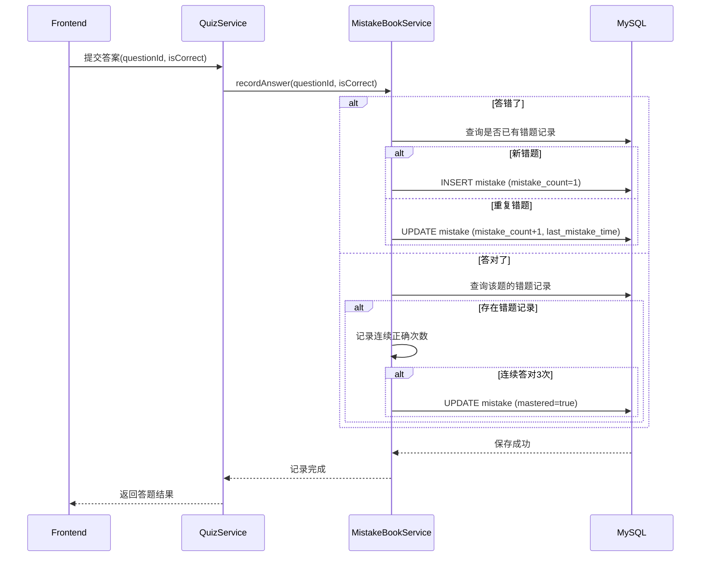
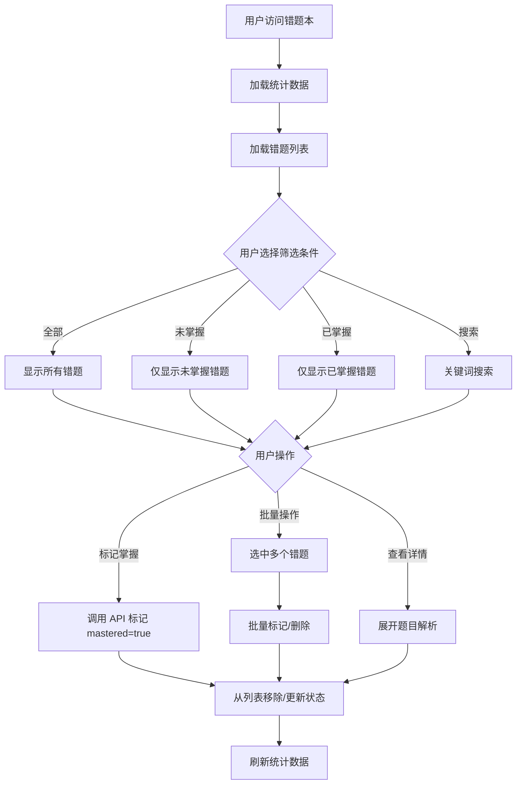
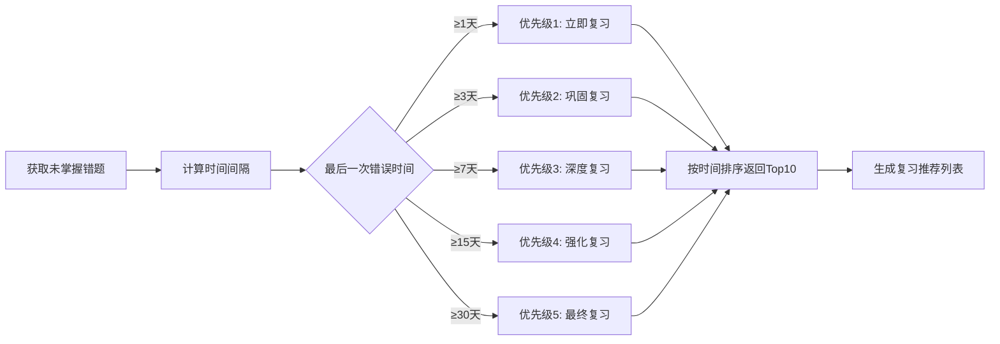

# 错题本模块（Mistake Book Module）

## 模块概述

错题本模块是 Review Agent 学习体系的核心组件，用于追踪和管理用户在测验中答错的题目，基于遗忘曲线理论提供智能复习推荐，帮助用户系统性巩固薄弱知识点。

### 核心价值

- **错题自动记录**：用户答错题目时自动加入错题本，记录错误次数与最后错误时间
- **掌握状态追踪**：支持手动标记或自动判断（连续答对3次）题目为"已掌握"
- **智能复习推荐**：基于艾宾浩斯遗忘曲线（1天/3天/7天/15天/30天）推荐待复习错题
- **多维度筛选**：支持按掌握状态、关键词、题型等多维度筛选错题
- **批量操作**：支持批量标记掌握和批量删除，提升复习效率

## 业务流程

### 1. 错题记录流程



### 2. 错题本查看与复习流程



### 3. 遗忘曲线复习推荐流程



## 技术实现

### 后端架构

#### 1. 实体层（Entity）

**Mistake.java** - 错题记录实体
```java
@Entity
@Table(name = "quiz_mistake")
public class Mistake {
    private Long id;
    private Long userId;              // 用户ID
    private Long questionId;           // 题目ID
    private Long quizId;               // 来源测验ID
    private Integer mistakeCount;      // 错误次数
    private LocalDateTime lastMistakeTime;  // 最后错误时间
    private Boolean mastered;          // 是否已掌握
    private LocalDateTime createdTime;
    private LocalDateTime updatedTime;
}
```

**QuestionType.java** - 题目类型枚举
- `SINGLE_CHOICE` - 单选题
- `MULTIPLE_CHOICE` - 多选题
- `TRUE_FALSE` - 判断题
- `FILL_BLANK` - 填空题
- `CODE_SNIPPET` - 代码识别题

**MistakeVo.java** - 错题视图对象
```java
public class MistakeVo {
    private Long id;
    private Long questionId;
    private String questionText;       // 题目内容
    private String questionType;       // 题型
    private String optionsJson;        // 选项JSON
    private String correctAnswer;      // 正确答案
    private String explanation;        // 答案解析
    private String knowledgePoint;     // 知识点
    private Integer mistakeCount;      // 错误次数
    private LocalDateTime lastMistakeTime;
    private Boolean mastered;
    private LocalDateTime createdTime;
}
```

#### 2. Repository层

**MistakeRepository.java**
```java
public interface MistakeRepository extends JpaRepository<Mistake, Long> {
    List<Mistake> findByUserId(Long userId);
    List<Mistake> findUnmasteredByUserId(Long userId);
    List<Mistake> findByUserIdAndQuestionId(Long userId, Long questionId);
    List<Mistake> findByUserIdAndTimeRange(Long userId, LocalDateTime startTime, LocalDateTime endTime);
    long countUnmasteredByUserId(Long userId);
    long countMasteredByUserId(Long userId);
    void deleteByUserId(Long userId);
    List<Mistake> findRecentMistakesByUserId(Long userId);
}
```

#### 3. Service层

**MistakeBookService.java**

核心方法：
- `recordAnswer(Long questionId, boolean isCorrect, Long quizId)` - 记录答题结果，自动更新错题本
- `getMistakeList(String filter)` - 获取错题列表（支持筛选：all/unmastered/mastered）
- `getMistakeStats()` - 获取错题统计信息
- `batchMarkMastered(List<Long> questionIds)` - 批量标记为已掌握
- `batchDelete(List<Long> questionIds)` - 批量删除错题
- `getReviewRecommendation()` - 获取基于遗忘曲线的复习推荐

#### 4. Controller层

**MistakeBookController.java**

REST API端点：
```
GET  /api/mistake-book/list?filter={filter}    # 获取错题列表
GET  /api/mistake-book/stats                   # 获取统计信息
POST /api/mistake-book/mark-mastered           # 标记为已掌握
DELETE /api/mistake-book/delete                # 删除错题
GET  /api/mistake-book/review-recommendation   # 获取复习推荐（TODO）
```

### 前端架构

#### 1. 页面组件

**MistakeBookPage.vue**

核心功能：
- 统计卡片展示（总错题数、待掌握、已掌握）
- 筛选栏（全部/未掌握/已掌握 + 搜索框）
- 批量操作栏（标记已掌握、删除）
- 错题卡片列表（支持点击查看详情、单项操作）

关键状态：
```javascript
const mistakes = ref([])                    // 错题列表
const selectedMistakes = ref(new Set())     // 已选错题
const stats = ref({ total: 0, unmastered: 0, mastered: 0 })
const filterMode = ref('all')               // 筛选模式
const searchKeyword = ref('')               // 搜索关键词
```

#### 2. API接口

**frontend/src/api/http.js**
```javascript
// Mistake Book API
getMistakeList(filter = 'all')
getMistakeStats()
markMistakesMastered(questionIds)
deleteMistakes(questionIds)
```

#### 3. 路由配置

**frontend/src/router/index.js**
```javascript
{
  path: '/mistake-book',
  component: MistakeBookPage,
  meta: { title: '错题本' }
}
```

#### 4. 导航集成

**App.vue** - 左侧边栏
- 桌面端和移动端均添加错题本入口
- 使用 `WarningFilled` 图标

## 数据库设计

### quiz_mistake 表

| 字段名 | 类型 | 约束 | 说明 |
|---|---|---|---|
| id | BIGINT | PK, AUTO_INCREMENT | 主键 |
| user_id | BIGINT | NOT NULL, FK | 用户ID |
| question_id | BIGINT | NOT NULL, FK | 题目ID |
| quiz_id | BIGINT | FK | 来源测验ID（可溯源） |
| mistake_count | INT | DEFAULT 1 | 错误次数 |
| last_mistake_time | DATETIME | | 最后一次错误时间 |
| mastered | BOOLEAN | DEFAULT FALSE | 是否已掌握 |
| created_time | DATETIME | DEFAULT NOW() | 创建时间 |
| updated_time | DATETIME | ON UPDATE NOW() | 更新时间 |

**索引：**
- `idx_user_mastered (user_id, mastered)` - 优化筛选查询
- `idx_question (question_id)` - 优化题目关联查询
- `idx_last_mistake (user_id, last_mistake_time)` - 优化复习推荐查询

**外键：**
- `fk_mistake_user` → `user_info(id)` ON DELETE CASCADE
- `fk_mistake_question` → `quiz_question(id)` ON DELETE CASCADE
- `fk_mistake_quiz` → `quiz_record(id)` ON DELETE SET NULL

### 扩展字段（quiz_question 表）

| 字段名 | 类型 | 说明 |
|---|---|---|
| question_type | VARCHAR(20) | 题目类型（single_choice/multiple_choice/true_false/fill_blank/code_snippet） |
| difficulty_level | TINYINT | 难度等级（1-5） |
| knowledge_point | VARCHAR(100) | 知识点标签 |
| time_limit | INT | 答题时限（秒） |
| answer_count | INT | 被回答次数 |
| correct_count | INT | 正确次数 |

## 依赖关系

### 上游依赖

- **Quiz模块**：提供测验题目和答题记录
- **User模块**：提供用户认证和上下文信息
- **Analysis模块**：提供分析结果（知识来源）

### 下游影响

- **KnowledgeMastery模块**：错题数据更新知识点掌握度
- **Achievement模块**：错题掌握进度影响成就解锁

## 设计亮点

### 1. 自动化错题记录

用户答错题目时自动加入错题本，无需手动操作，降低用户操作成本。

### 2. 遗忘曲线算法

基于艾宾浩斯遗忘曲线理论，智能推荐最佳复习时机：
- 1天后：首次复习（记忆最薄弱）
- 3天后：二次巩固
- 7天后：深度强化
- 15天后：长期保持
- 30天后：最终检验

### 3. 多维度筛选

支持按掌握状态、关键词、题型等多维度筛选，快速定位目标错题。

### 4. 批量操作

支持批量标记掌握和批量删除，提升复习效率。

### 5. 数据溯源

记录来源测验ID（quiz_id），支持错题溯源。

## 合规性检查

### 阿里巴巴 Java 开发手册

✅ **命名规范**
- 实体类：`Mistake`, `MistakeVo`
- Repository：`MistakeRepository`
- Service：`MistakeBookService`
- Controller：`MistakeBookController`
- 字段名：驼峰命名（mistakeCount, lastMistakeTime）

✅ **异常处理**
- Controller层统一捕获异常并返回友好提示
- Service层抛出异常触发事务回滚
- 日志记录关键操作和异常信息

✅ **事务边界**
- 写操作方法标注 `@Transactional(rollbackFor = Exception.class)`
- 查询方法使用只读事务优化性能

✅ **参数校验**
- 实体类使用 `@NotNull` 注解进行字段校验
- Controller层校验请求参数（questionIds 不能为空）

✅ **日志规范**
- 使用 Slf4j 记录关键操作
- 日志级别：INFO（正常操作）、ERROR（异常情况）

## 未来优化方向

### 1. 连续答对追踪

当前实现中，连续答对3次的逻辑未完全落地，建议：
- 在 `Mistake` 实体增加 `consecutiveCorrectCount` 字段
- `recordAnswer` 方法中更新连续正确次数
- 达到3次时自动标记 `mastered = true`

### 2. 复习推荐完善

当前复习推荐功能为 TODO 状态，建议：
- 完善 `getReviewRecommendation` 方法返回 VO
- 前端增加"今日推荐"入口
- 增加复习记录表（记录每次复习的时间与结果）

### 3. 错题分析报告

基于错题数据生成可视化报告：
- 知识点薄弱环节分析
- 题型掌握度分布
- 错误趋势曲线
- 复习效果评估

### 4. 智能练习模式

针对错题生成专项练习：
- 仅限错题的快速测验模式
- 错题相似题目推荐
- 错题知识点扩展练习

## 相关文档

- [数据库迁移脚本](../../backend/src/main/resources/sql/migration_quiz_enhancements.sql)
- [后端 Service 实现](../../backend/src/main/java/com/review/agent/service/MistakeBookService.java)
- [前端页面实现](../../frontend/src/pages/MistakeBookPage.vue)
- [API 接口定义](../../frontend/src/api/http.js)

---

**文档版本：** v1.0
**创建日期：** 2026-02-01
**最后更新：** 2026-02-01
**作者：** Review Agent Team
